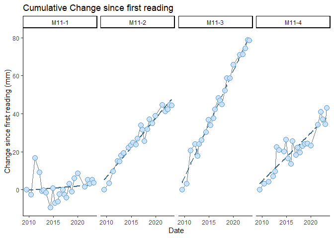
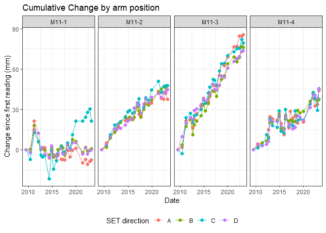

<!-- README.md is generated from README.Rmd. Please edit that file -->

# SETrNCBN

<!-- badges: start -->
<!-- badges: end -->

The goal of SETrNCBN is to simplify calculations and make graphs for
QA/QC and communication of NCBN Surface Elevation Table (SET) data.

This package is under development [GitHub,
here](https://github.com/laura-feher/NCBN_SETr).

This package is based on the [SETr](https://github.com/swmpkim/SETr)
package developed by Kim Cressman.

## Installation

You can install the development version from
[GitHub](https://github.com/) with:

``` r
# install.packages("devtools")
devtools::install_github("laura-feher/SETrNCBN")
```

## Example

This is a basic example which shows you how to make a simple graph of
change since the first reading at each SET:

``` r
library(SETrNCBN)

# first, perform cumulative change calculations
cumu_set <- calc_change_cumu(example_sets)

# now plot cumulative change by SET
plot_cumu_set(example_sets)
```



``` r

# or by arm, at a single SET
plot_cumu_arm(example_sets)
```


