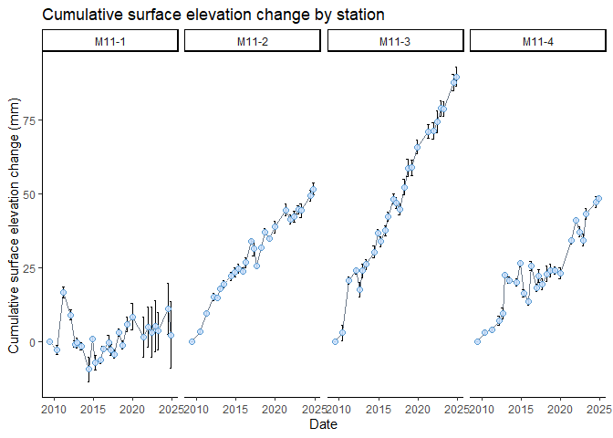

<!-- README.md is generated from README.Rmd. Please edit that file -->

# SETrNCBN

<!-- badges: start -->

<!-- badges: end -->

The goal of SETrNCBN is to simplify the calculation of cumulative rates
of surface elevation change and vertical accretion from the National
Park Services’ Surface Elevation Table (SET) data.

This package is under development [GitHub,
here](https://github.com/laura-feher/NCBN_SETr).

This package is based on the [SETr](https://github.com/swmpkim/SETr)
package developed by Kim Cressman.

## Installation

You can install the development version from
[GitHub](https://github.com/) with:

``` r
# install.packages("devtools")
devtools::install_github("laura-feher/SETrNCBN")
```

## Load SET or MH data

Data can be pulled from the SET database using load_set_data() for SET
data or load_mh_data() for SET and MH data, respectively. Use the park
or network code options to limit the data to a specific park(s) or I&M
network(s).

``` r
library(SETrNCBN)

set_df <- load_set_data(network_code = "NETN")
head(set_df)
#>   network_code                network_name park_code            park_name
#> 1         NETN Northeast Temperate Network      ACAD Acadia National Park
#> 2         NETN Northeast Temperate Network      ACAD Acadia National Park
#> 3         NETN Northeast Temperate Network      ACAD Acadia National Park
#> 4         NETN Northeast Temperate Network      ACAD Acadia National Park
#> 5         NETN Northeast Temperate Network      ACAD Acadia National Park
#> 6         NETN Northeast Temperate Network      ACAD Acadia National Park
#>     site_name station_code      station_name event_date_UTC event_time_UTC
#> 1 Bass Harbor      BH1 old Bass Harbor 1 Old     2016-05-25       04:00:00
#> 2 Bass Harbor      BH1 old Bass Harbor 1 Old     2016-05-25       04:00:00
#> 3 Bass Harbor      BH1 old Bass Harbor 1 Old     2016-05-25       04:00:00
#> 4 Bass Harbor      BH1 old Bass Harbor 1 Old     2016-05-25       04:00:00
#> 5 Bass Harbor      BH1 old Bass Harbor 1 Old     2016-05-25       04:00:00
#> 6 Bass Harbor      BH1 old Bass Harbor 1 Old     2016-05-25       04:00:00
#>            SET_reader   SET_recorder SET_instrument SET_direction_azimuth
#> 1 Lynch, James - NETN Not, Available      ACAD RSET                   260
#> 2 Lynch, James - NETN Not, Available      ACAD RSET                   260
#> 3 Lynch, James - NETN Not, Available      ACAD RSET                   260
#> 4 Lynch, James - NETN Not, Available      ACAD RSET                   260
#> 5 Lynch, James - NETN Not, Available      ACAD RSET                   260
#> 6 Lynch, James - NETN Not, Available      ACAD RSET                   260
#>   SET_direction pin_position pin_height_mm standardized_soil_elev_mm
#> 1             D            1           170                      -199
#> 2             D            2           172                      -197
#> 3             D            3           167                      -202
#> 4             D            4           160                      -209
#> 5             D            5           157                      -212
#> 6             D            6           155                      -214
#>   soil_elev_m pin_flag_code pin_flag_label pin_flag_notes vegetation_notes
#> 1       1.258          <NA>           <NA>             NA             <NA>
#> 2       1.260          <NA>           <NA>             NA             <NA>
#> 3       1.255          <NA>           <NA>             NA             <NA>
#> 4       1.248          <NA>           <NA>             NA             <NA>
#> 5       1.245          <NA>           <NA>             NA             <NA>
#> 6       1.243          <NA>           <NA>             NA             <NA>
#>   SET_direction_notes SET_notes observation_type double_read_type dpl_label
#> 1                <NA>      <NA>         Standard             <NA>  Accepted
#> 2                <NA>      <NA>         Standard             <NA>  Accepted
#> 3                <NA>      <NA>         Standard             <NA>  Accepted
#> 4                <NA>      <NA>         Standard             <NA>  Accepted
#> 5                <NA>      <NA>         Standard             <NA>  Accepted
#> 6                <NA>      <NA>         Standard             <NA>  Accepted
#>                                                                                                           dpl_note
#> 1 Bulk update of DPL from ‘Provisional’ to ‘Accepted’ conducted by NER DM Adam Kozlowski upon request of Jim Lynch
#> 2 Bulk update of DPL from ‘Provisional’ to ‘Accepted’ conducted by NER DM Adam Kozlowski upon request of Jim Lynch
#> 3 Bulk update of DPL from ‘Provisional’ to ‘Accepted’ conducted by NER DM Adam Kozlowski upon request of Jim Lynch
#> 4 Bulk update of DPL from ‘Provisional’ to ‘Accepted’ conducted by NER DM Adam Kozlowski upon request of Jim Lynch
#> 5 Bulk update of DPL from ‘Provisional’ to ‘Accepted’ conducted by NER DM Adam Kozlowski upon request of Jim Lynch
#> 6 Bulk update of DPL from ‘Provisional’ to ‘Accepted’ conducted by NER DM Adam Kozlowski upon request of Jim Lynch
#>       pin_collection      pin_label pin_length_mm station_elev_m station_datum
#> 1 ACAD RSET 30" Pins ACAD RSET pin1           762          1.457        NAVD88
#> 2 ACAD RSET 30" Pins ACAD RSET pin2           762          1.457        NAVD88
#> 3 ACAD RSET 30" Pins ACAD RSET pin3           762          1.457        NAVD88
#> 4 ACAD RSET 30" Pins ACAD RSET pin4           762          1.457        NAVD88
#> 5 ACAD RSET 30" Pins ACAD RSET pin5           762          1.457        NAVD88
#> 6 ACAD RSET 30" Pins ACAD RSET pin6           762          1.457        NAVD88
#>   SET_offset_mm validation_status validation_date validation_time
#> 1           393 ManuallyValidated      2021-03-30        12:00:00
#> 2           393 ManuallyValidated      2021-03-30        12:00:00
#> 3           393 ManuallyValidated      2021-03-30        12:00:00
#> 4           393 ManuallyValidated      2021-03-30        12:00:00
#> 5           393 ManuallyValidated      2021-03-30        12:00:00
#> 6           393 ManuallyValidated      2021-03-30        12:00:00
#>   validation_name exclude_int_user_ID exclude_int_user exclude_int_reason_ID
#> 1    Lynch, James                  NA             <NA>                    NA
#> 2    Lynch, James                  NA             <NA>                    NA
#> 3    Lynch, James                  NA             <NA>                    NA
#> 4    Lynch, James                  NA             <NA>                    NA
#> 5    Lynch, James                  NA             <NA>                    NA
#> 6    Lynch, James                  NA             <NA>                    NA
#>   exclude_int_reason exclude_int_date exclude_cumul_user_ID exclude_cumul_user
#> 1               <NA>             <NA>                    NA               <NA>
#> 2               <NA>             <NA>                    NA               <NA>
#> 3               <NA>             <NA>                    NA               <NA>
#> 4               <NA>             <NA>                    NA               <NA>
#> 5               <NA>             <NA>                    NA               <NA>
#> 6               <NA>             <NA>                    NA               <NA>
#>   exclude_cumul_reason_ID exclude_cumul_reason exclude_cumul_date
#> 1                      NA                 <NA>               <NA>
#> 2                      NA                 <NA>               <NA>
#> 3                      NA                 <NA>               <NA>
#> 4                      NA                 <NA>               <NA>
#> 5                      NA                 <NA>               <NA>
#> 6                      NA                 <NA>               <NA>
```

You can also supply a list of multiple parks or networks:

``` r
set_df <- load_set_data(park = c("ASIS", "COLO"))
head(set_df)
#>   network_code                          network_name park_code
#> 1         NCBN Northeast Coastal and Barrier Network      ASIS
#> 2         NCBN Northeast Coastal and Barrier Network      ASIS
#> 3         NCBN Northeast Coastal and Barrier Network      ASIS
#> 4         NCBN Northeast Coastal and Barrier Network      ASIS
#> 5         NCBN Northeast Coastal and Barrier Network      ASIS
#> 6         NCBN Northeast Coastal and Barrier Network      ASIS
#>                             park_name           site_name station_code
#> 1 Assateague Island National Seashore Marsh 6 (Pine Tree)         M6-4
#> 2 Assateague Island National Seashore Marsh 6 (Pine Tree)         M6-4
#> 3 Assateague Island National Seashore Marsh 6 (Pine Tree)         M6-4
#> 4 Assateague Island National Seashore Marsh 6 (Pine Tree)         M6-4
#> 5 Assateague Island National Seashore Marsh 6 (Pine Tree)         M6-4
#> 6 Assateague Island National Seashore Marsh 6 (Pine Tree)         M6-4
#>   station_name event_date_UTC event_time_UTC          SET_reader   SET_recorder
#> 1         M6-4     2016-03-28       04:00:00 Lynch, James - NCBN Kramer, Lauren
#> 2         M6-4     2016-03-28       04:00:00 Lynch, James - NCBN Kramer, Lauren
#> 3         M6-4     2016-03-28       04:00:00 Lynch, James - NCBN Kramer, Lauren
#> 4         M6-4     2016-03-28       04:00:00 Lynch, James - NCBN Kramer, Lauren
#> 5         M6-4     2016-03-28       04:00:00 Lynch, James - NCBN Kramer, Lauren
#> 6         M6-4     2015-04-23       04:00:00 Lynch, James - NCBN Kramer, Lauren
#>   SET_instrument SET_direction_azimuth SET_direction pin_position pin_height_mm
#> 1      ASIS RSET                    90             C            1           225
#> 2      ASIS RSET                   180             D            4           234
#> 3      ASIS RSET                    90             C            4           226
#> 4      ASIS RSET                   180             D            7           227
#> 5      ASIS RSET                    90             C            7           236
#> 6      ASIS RSET                   270             A            1           223
#>   standardized_soil_elev_mm soil_elev_m pin_flag_code pin_flag_label
#> 1                      -144       0.098          <NA>           <NA>
#> 2                      -135       0.107          <NA>           <NA>
#> 3                      -143       0.099          <NA>           <NA>
#> 4                      -142       0.100          <NA>           <NA>
#> 5                      -133       0.109          <NA>           <NA>
#> 6                      -146       0.096          <NA>           <NA>
#>   pin_flag_notes vegetation_notes SET_direction_notes SET_notes
#> 1             NA             <NA>                <NA>      <NA>
#> 2             NA             <NA>                <NA>      <NA>
#> 3             NA             <NA>                <NA>      <NA>
#> 4             NA             <NA>                <NA>      <NA>
#> 5             NA             <NA>                <NA>      <NA>
#> 6             NA             <NA>                <NA>      <NA>
#>   observation_type double_read_type dpl_label
#> 1         Standard             <NA>  Accepted
#> 2         Standard             <NA>  Accepted
#> 3         Standard             <NA>  Accepted
#> 4         Standard             <NA>  Accepted
#> 5         Standard             <NA>  Accepted
#> 6         Standard             <NA>  Accepted
#>                                                                                                           dpl_note
#> 1 Bulk update of DPL from ‘Provisional’ to ‘Accepted’ conducted by NER DM Adam Kozlowski upon request of Jim Lynch
#> 2 Bulk update of DPL from ‘Provisional’ to ‘Accepted’ conducted by NER DM Adam Kozlowski upon request of Jim Lynch
#> 3 Bulk update of DPL from ‘Provisional’ to ‘Accepted’ conducted by NER DM Adam Kozlowski upon request of Jim Lynch
#> 4 Bulk update of DPL from ‘Provisional’ to ‘Accepted’ conducted by NER DM Adam Kozlowski upon request of Jim Lynch
#> 5 Bulk update of DPL from ‘Provisional’ to ‘Accepted’ conducted by NER DM Adam Kozlowski upon request of Jim Lynch
#> 6 Bulk update of DPL from ‘Provisional’ to ‘Accepted’ conducted by NER DM Adam Kozlowski upon request of Jim Lynch
#>       pin_collection pin_label pin_length_mm station_elev_m station_datum
#> 1 ASIS RSET 30" pins     ASIS1           762          0.242        NAVD88
#> 2 ASIS RSET 30" pins     ASIS4           762          0.242        NAVD88
#> 3 ASIS RSET 30" pins     ASIS4           762          0.242        NAVD88
#> 4 ASIS RSET 30" pins     ASIS7           762          0.242        NAVD88
#> 5 ASIS RSET 30" pins     ASIS7           762          0.242        NAVD88
#> 6 ASIS RSET 30" pins     ASIS1           762          0.242        NAVD88
#>   SET_offset_mm validation_status validation_date validation_time
#> 1           393 ManuallyValidated      2021-03-30        12:00:00
#> 2           393 ManuallyValidated      2021-03-30        12:00:00
#> 3           393 ManuallyValidated      2021-03-30        12:00:00
#> 4           393 ManuallyValidated      2021-03-30        12:00:00
#> 5           393 ManuallyValidated      2021-03-30        12:00:00
#> 6           393 ManuallyValidated      2021-03-30        12:00:00
#>   validation_name exclude_int_user_ID exclude_int_user exclude_int_reason_ID
#> 1    Lynch, James                  NA             <NA>                    NA
#> 2    Lynch, James                  NA             <NA>                    NA
#> 3    Lynch, James                  NA             <NA>                    NA
#> 4    Lynch, James                  NA             <NA>                    NA
#> 5    Lynch, James                  NA             <NA>                    NA
#> 6    Lynch, James                  NA             <NA>                    NA
#>   exclude_int_reason exclude_int_date exclude_cumul_user_ID exclude_cumul_user
#> 1               <NA>             <NA>                    NA               <NA>
#> 2               <NA>             <NA>                    NA               <NA>
#> 3               <NA>             <NA>                    NA               <NA>
#> 4               <NA>             <NA>                    NA               <NA>
#> 5               <NA>             <NA>                    NA               <NA>
#> 6               <NA>             <NA>                    NA               <NA>
#>   exclude_cumul_reason_ID exclude_cumul_reason exclude_cumul_date
#> 1                      NA                 <NA>               <NA>
#> 2                      NA                 <NA>               <NA>
#> 3                      NA                 <NA>               <NA>
#> 4                      NA                 <NA>               <NA>
#> 5                      NA                 <NA>               <NA>
#> 6                      NA                 <NA>               <NA>
```

Alternatively, if you have your data saved in a csv or xlsx file, you
can load it into R by supplying a file path. For SET data, your data
file will need to have the columns “event_date_UTC”, “network_code”,
“park_code”, “site_name”, “station_code”, “SET_direction”,
“pin_position”, “pin_height_mm”. For MH data, your data file will need
to have the columns “event_date_UTC”, “network_code”, “park_code”,
“site_name”, “station_code”, “marker_horizon_name”,
“core_measurement_number”, “core_measurement_depth_mm”,
“established_date”.

``` r
set_df <- load_set_data(file_path = "./data/example_sets.csv")
head(set_df)
#> # A tibble: 6 × 11
#>   event_date_UTC network_code park_code site_name station_code SET_direction
#>   <date>         <chr>        <chr>     <chr>     <chr>        <chr>        
#> 1 2016-03-30     NCBN         ASIS      Marsh 11  M11-3        C            
#> 2 2014-12-01     NCBN         ASIS      Marsh 11  M11-3        A            
#> 3 2014-12-01     NCBN         ASIS      Marsh 11  M11-3        B            
#> 4 2014-12-01     NCBN         ASIS      Marsh 11  M11-3        B            
#> 5 2014-12-01     NCBN         ASIS      Marsh 11  M11-3        A            
#> 6 2014-12-01     NCBN         ASIS      Marsh 11  M11-3        A            
#> # ℹ 5 more variables: pin_position <dbl>, SET_offset_mm <dbl>,
#> #   pin_length_mm <dbl>, pin_height_mm <dbl>, set_type <chr>
```

## Calculate Station-Level Cumulative Change

The function calc_change_cumu() can be used to calculate station-level
cumulative surface elevation change from SET data or vertical accretion
from MH data. The resulting data frame has the mean station-level
cumulative change for each sampling date.

``` r
calc_change_cumu(example_sets)
#> # A tibble: 104 × 9
#> # Groups:   network_code, park_code, site_name, station_code [4]
#>    network_code park_code site_name station_code event_date_UTC mean_cumu
#>    <chr>        <chr>     <chr>     <chr>        <date>             <dbl>
#>  1 NCBN         ASIS      Marsh 11  M11-1        2009-06-22         0    
#>  2 NCBN         ASIS      Marsh 11  M11-1        2010-06-08        -2.58 
#>  3 NCBN         ASIS      Marsh 11  M11-1        2011-04-07        16.9  
#>  4 NCBN         ASIS      Marsh 11  M11-1        2012-03-07         9.17 
#>  5 NCBN         ASIS      Marsh 11  M11-1        2012-08-28        -0.75 
#>  6 NCBN         ASIS      Marsh 11  M11-1        2012-12-18        -0.25 
#>  7 NCBN         ASIS      Marsh 11  M11-1        2013-06-20        -1.42 
#>  8 NCBN         ASIS      Marsh 11  M11-1        2014-06-03        -9.25 
#>  9 NCBN         ASIS      Marsh 11  M11-1        2014-12-01         0.917
#> 10 NCBN         ASIS      Marsh 11  M11-1        2015-04-23        -7.03 
#> # ℹ 94 more rows
#> # ℹ 3 more variables: sd_cumu <dbl>, se_cumu <dbl>, data_type <chr>
```

## Plot Station-Level Cumulative Change

The function plot_station_cumu can be used to plot station-level
cumulative surface elevation change from SET data or vertical accretion
from MH data.

``` r
plot_cumu(SET_data = example_sets)
```


``` r
plot_cumu(MH_data = example_mh)
```


You can also plot SET and MH data for each station together on a single
plot:

``` r
library(ggh4x)
plot_cumu(SET_data = example_sets, MH_data = example_mh, columns = 2)
```



## Calculate Linear Rates of Change

The function calc_linear_rates() can be used to calculate simple linear
rates of change at the station-level in mm/yr.

``` r
set_rates <- calc_linear_rates(example_sets)

set_rates %>%
    dplyr::ungroup() %>%
    dplyr::select(park_code, station_code, rate, rate_se, rate_type)
#> # A tibble: 4 × 5
#>   park_code station_code  rate rate_se rate_type
#>   <chr>     <chr>        <dbl>   <dbl> <chr>    
#> 1 ASIS      M11-1        0.328   0.258 station  
#> 2 ASIS      M11-2        3.04    0.124 station  
#> 3 ASIS      M11-3        5.59    0.138 station  
#> 4 ASIS      M11-4        2.72    0.226 station
```

## Visually Compare Station-Level Rates of Change

The functions plot_set_rate_comps() and plot_set_mh_comps() can be used
to create ‘tie fighter’ plots that are helpful for visually comparing
rates between stations:

``` r
plot_rate_comps(example_sets)
```


Alternatively, if you’ve already calculated rates of change and want to
plot those, you can use ‘calc_rates’ = FALSE and supply a data frame of
rates that has columns for station IDs, station-level rates, and station
rate std errors with one row per station:

``` r
example_rates <- data.frame(
    "station_code" = c("station_1", "station_2", "station_3"),
    "rate" = c(3.2, 4.0, 5.4),
    "rate_se" = c(1, 0.5, 0.25))

plot_rate_comps(rates = example_rates, level = "station")
```


## Get Park-Specific SLR Rates

The function get_sea_level_data() can be used to get rates of sea-level
rise from the NOAA tide gauge that is closest to the park. The function
returns a list with 2 dataframes: ‘slr_data’ is the relative sea-level
data downloaded from the NOAA tides and currents website; ‘slr_rate’
provides the calculated rate of sea-level rise, standard error of the
SLR rate, lower confidence interval, upper, minimum year of data used
for calculating SLR, and maximum year of data used for calculating SLR:

``` r
get_sea_level_data("ASIS")
#> $slr_data
#>     Year Month Linear_Trend High_Conf. Low_Conf.       date   min_date
#> 1   1975     6       -0.086     -0.064    -0.109 1975-06-01 1975-06-01
#> 2   1975     7       -0.086     -0.064    -0.108 1975-07-01 1975-06-01
#> 3   1975     8       -0.086     -0.064    -0.108 1975-08-01 1975-06-01
#> 4   1975     9       -0.085     -0.063    -0.107 1975-09-01 1975-06-01
#> 5   1975    10       -0.085     -0.063    -0.107 1975-10-01 1975-06-01
#> 6   1975    11       -0.084     -0.062    -0.106 1975-11-01 1975-06-01
#> 7   1975    12       -0.084     -0.062    -0.106 1975-12-01 1975-06-01
#> 8   1976     1       -0.083     -0.062    -0.105 1976-01-01 1975-06-01
#> 9   1976    10       -0.079     -0.058    -0.101 1976-10-01 1975-06-01
#> 10  1976    11       -0.079     -0.058    -0.100 1976-11-01 1975-06-01
#> 11  1976    12       -0.079     -0.057    -0.100 1976-12-01 1975-06-01
#> 12  1977     1       -0.078     -0.057    -0.099 1977-01-01 1975-06-01
#> 13  1977     2       -0.078     -0.057    -0.099 1977-02-01 1975-06-01
#> 14  1977     3       -0.077     -0.056    -0.098 1977-03-01 1975-06-01
#> 15  1977     4       -0.077     -0.056    -0.098 1977-04-01 1975-06-01
#> 16  1977     5       -0.076     -0.055    -0.097 1977-05-01 1975-06-01
#> 17  1977     6       -0.076     -0.055    -0.097 1977-06-01 1975-06-01
#> 18  1977     7       -0.075     -0.055    -0.096 1977-07-01 1975-06-01
#> 19  1977     8       -0.075     -0.054    -0.096 1977-08-01 1975-06-01
#> 20  1977     9       -0.075     -0.054    -0.095 1977-09-01 1975-06-01
#> 21  1977    10       -0.074     -0.053    -0.095 1977-10-01 1975-06-01
#> 22  1977    11       -0.074     -0.053    -0.094 1977-11-01 1975-06-01
#> 23  1977    12       -0.073     -0.053    -0.094 1977-12-01 1975-06-01
#> 24  1978     5       -0.071     -0.051    -0.091 1978-05-01 1975-06-01
#> 25  1978     6       -0.071     -0.050    -0.091 1978-06-01 1975-06-01
#> 26  1978     7       -0.070     -0.050    -0.090 1978-07-01 1975-06-01
#> 27  1978     8       -0.070     -0.050    -0.090 1978-08-01 1975-06-01
#> 28  1978     9       -0.069     -0.049    -0.089 1978-09-01 1975-06-01
#> 29  1978    10       -0.069     -0.049    -0.089 1978-10-01 1975-06-01
#> 30  1978    11       -0.068     -0.048    -0.088 1978-11-01 1975-06-01
#> 31  1978    12       -0.068     -0.048    -0.088 1978-12-01 1975-06-01
#> 32  1979     1       -0.068     -0.048    -0.087 1979-01-01 1975-06-01
#> 33  1981     6       -0.055     -0.036    -0.073 1981-06-01 1975-06-01
#> 34  1981     7       -0.054     -0.036    -0.073 1981-07-01 1975-06-01
#> 35  1981     8       -0.054     -0.035    -0.072 1981-08-01 1975-06-01
#> 36  1981     9       -0.053     -0.035    -0.072 1981-09-01 1975-06-01
#> 37  1981    10       -0.053     -0.035    -0.071 1981-10-01 1975-06-01
#> 38  1981    11       -0.053     -0.034    -0.071 1981-11-01 1975-06-01
#> 39  1981    12       -0.052     -0.034    -0.070 1981-12-01 1975-06-01
#> 40  1982     1       -0.052     -0.033    -0.070 1982-01-01 1975-06-01
#> 41  1982     2       -0.051     -0.033    -0.069 1982-02-01 1975-06-01
#> 42  1982     3       -0.051     -0.033    -0.069 1982-03-01 1975-06-01
#> 43  1982     4       -0.050     -0.032    -0.068 1982-04-01 1975-06-01
#> 44  1982     5       -0.050     -0.032    -0.068 1982-05-01 1975-06-01
#> 45  1982     6       -0.049     -0.032    -0.067 1982-06-01 1975-06-01
#> 46  1982     7       -0.049     -0.031    -0.067 1982-07-01 1975-06-01
#> 47  1982     8       -0.049     -0.031    -0.066 1982-08-01 1975-06-01
#> 48  1982     9       -0.048     -0.030    -0.066 1982-09-01 1975-06-01
#> 49  1982    10       -0.048     -0.030    -0.065 1982-10-01 1975-06-01
#> 50  1982    11       -0.047     -0.030    -0.065 1982-11-01 1975-06-01
#> 51  1982    12       -0.047     -0.029    -0.064 1982-12-01 1975-06-01
#> 52  1983     1       -0.046     -0.029    -0.064 1983-01-01 1975-06-01
#> 53  1983     2       -0.046     -0.028    -0.064 1983-02-01 1975-06-01
#> 54  1983     3       -0.045     -0.028    -0.063 1983-03-01 1975-06-01
#> 55  1983     4       -0.045     -0.028    -0.063 1983-04-01 1975-06-01
#> 56  1983     5       -0.045     -0.027    -0.062 1983-05-01 1975-06-01
#> 57  1983     6       -0.044     -0.027    -0.062 1983-06-01 1975-06-01
#> 58  1983     7       -0.044     -0.026    -0.061 1983-07-01 1975-06-01
#> 59  1983     8       -0.043     -0.026    -0.061 1983-08-01 1975-06-01
#> 60  1983     9       -0.043     -0.026    -0.060 1983-09-01 1975-06-01
#> 61  1983    10       -0.042     -0.025    -0.060 1983-10-01 1975-06-01
#> 62  1983    11       -0.042     -0.025    -0.059 1983-11-01 1975-06-01
#> 63  1983    12       -0.042     -0.024    -0.059 1983-12-01 1975-06-01
#> 64  1984     1       -0.041     -0.024    -0.058 1984-01-01 1975-06-01
#> 65  1984     2       -0.041     -0.024    -0.058 1984-02-01 1975-06-01
#> 66  1984     3       -0.040     -0.023    -0.057 1984-03-01 1975-06-01
#> 67  1984     4       -0.040     -0.023    -0.057 1984-04-01 1975-06-01
#> 68  1984     5       -0.039     -0.022    -0.056 1984-05-01 1975-06-01
#> 69  1984     6       -0.039     -0.022    -0.056 1984-06-01 1975-06-01
#> 70  1984     7       -0.038     -0.022    -0.055 1984-07-01 1975-06-01
#> 71  1984     8       -0.038     -0.021    -0.055 1984-08-01 1975-06-01
#> 72  1984     9       -0.038     -0.021    -0.054 1984-09-01 1975-06-01
#> 73  1984    10       -0.037     -0.020    -0.054 1984-10-01 1975-06-01
#> 74  1984    11       -0.037     -0.020    -0.053 1984-11-01 1975-06-01
#> 75  1984    12       -0.036     -0.020    -0.053 1984-12-01 1975-06-01
#> 76  1985     1       -0.036     -0.019    -0.052 1985-01-01 1975-06-01
#> 77  1985     2       -0.035     -0.019    -0.052 1985-02-01 1975-06-01
#> 78  1985     3       -0.035     -0.019    -0.051 1985-03-01 1975-06-01
#> 79  1985     4       -0.034     -0.018    -0.051 1985-04-01 1975-06-01
#> 80  1985     5       -0.034     -0.018    -0.050 1985-05-01 1975-06-01
#> 81  1985     6       -0.034     -0.017    -0.050 1985-06-01 1975-06-01
#> 82  1985     7       -0.033     -0.017    -0.049 1985-07-01 1975-06-01
#> 83  1985     8       -0.033     -0.017    -0.049 1985-08-01 1975-06-01
#> 84  1985     9       -0.032     -0.016    -0.048 1985-09-01 1975-06-01
#> 85  1985    10       -0.032     -0.016    -0.048 1985-10-01 1975-06-01
#> 86  1985    11       -0.031     -0.015    -0.047 1985-11-01 1975-06-01
#> 87  1985    12       -0.031     -0.015    -0.047 1985-12-01 1975-06-01
#> 88  1986     1       -0.031     -0.015    -0.047 1986-01-01 1975-06-01
#> 89  1986     2       -0.030     -0.014    -0.046 1986-02-01 1975-06-01
#> 90  1986     3       -0.030     -0.014    -0.046 1986-03-01 1975-06-01
#> 91  1986     4       -0.029     -0.013    -0.045 1986-04-01 1975-06-01
#> 92  1986     5       -0.029     -0.013    -0.045 1986-05-01 1975-06-01
#> 93  1986     6       -0.028     -0.013    -0.044 1986-06-01 1975-06-01
#> 94  1986     7       -0.028     -0.012    -0.044 1986-07-01 1975-06-01
#> 95  1986     8       -0.027     -0.012    -0.043 1986-08-01 1975-06-01
#> 96  1986     9       -0.027     -0.011    -0.043 1986-09-01 1975-06-01
#> 97  1986    10       -0.027     -0.011    -0.042 1986-10-01 1975-06-01
#> 98  1986    11       -0.026     -0.011    -0.042 1986-11-01 1975-06-01
#> 99  1986    12       -0.026     -0.010    -0.041 1986-12-01 1975-06-01
#> 100 1987     1       -0.025     -0.010    -0.041 1987-01-01 1975-06-01
#> 101 1987     2       -0.025     -0.009    -0.040 1987-02-01 1975-06-01
#> 102 1987     3       -0.024     -0.009    -0.040 1987-03-01 1975-06-01
#> 103 1987     4       -0.024     -0.009    -0.039 1987-04-01 1975-06-01
#> 104 1987     5       -0.023     -0.008    -0.039 1987-05-01 1975-06-01
#> 105 1987     6       -0.023     -0.008    -0.038 1987-06-01 1975-06-01
#> 106 1987     7       -0.023     -0.007    -0.038 1987-07-01 1975-06-01
#> 107 1987     8       -0.022     -0.007    -0.037 1987-08-01 1975-06-01
#> 108 1987     9       -0.022     -0.007    -0.037 1987-09-01 1975-06-01
#> 109 1987    10       -0.021     -0.006    -0.036 1987-10-01 1975-06-01
#> 110 1987    11       -0.021     -0.006    -0.036 1987-11-01 1975-06-01
#> 111 1987    12       -0.020     -0.005    -0.035 1987-12-01 1975-06-01
#> 112 1988     1       -0.020     -0.005    -0.035 1988-01-01 1975-06-01
#> 113 1988     2       -0.020     -0.005    -0.034 1988-02-01 1975-06-01
#> 114 1988     3       -0.019     -0.004    -0.034 1988-03-01 1975-06-01
#> 115 1988     4       -0.019     -0.004    -0.033 1988-04-01 1975-06-01
#> 116 1988     5       -0.018     -0.003    -0.033 1988-05-01 1975-06-01
#> 117 1988     6       -0.018     -0.003    -0.033 1988-06-01 1975-06-01
#> 118 1988     7       -0.017     -0.003    -0.032 1988-07-01 1975-06-01
#> 119 1988     8       -0.017     -0.002    -0.032 1988-08-01 1975-06-01
#> 120 1988     9       -0.016     -0.002    -0.031 1988-09-01 1975-06-01
#> 121 1988    10       -0.016     -0.001    -0.031 1988-10-01 1975-06-01
#> 122 1988    11       -0.016     -0.001    -0.030 1988-11-01 1975-06-01
#> 123 1988    12       -0.015     -0.001    -0.030 1988-12-01 1975-06-01
#> 124 1989     1       -0.015      0.000    -0.029 1989-01-01 1975-06-01
#> 125 1989     2       -0.014      0.000    -0.029 1989-02-01 1975-06-01
#> 126 1989     3       -0.014      0.001    -0.028 1989-03-01 1975-06-01
#> 127 1989     4       -0.013      0.001    -0.028 1989-04-01 1975-06-01
#> 128 1989     5       -0.013      0.001    -0.027 1989-05-01 1975-06-01
#> 129 1989     6       -0.012      0.002    -0.027 1989-06-01 1975-06-01
#> 130 1989     7       -0.012      0.002    -0.026 1989-07-01 1975-06-01
#> 131 1989     8       -0.012      0.003    -0.026 1989-08-01 1975-06-01
#> 132 1989     9       -0.011      0.003    -0.025 1989-09-01 1975-06-01
#> 133 1989    10       -0.011      0.003    -0.025 1989-10-01 1975-06-01
#> 134 1989    11       -0.010      0.004    -0.024 1989-11-01 1975-06-01
#> 135 1989    12       -0.010      0.004    -0.024 1989-12-01 1975-06-01
#> 136 1990     1       -0.009      0.005    -0.023 1990-01-01 1975-06-01
#> 137 1990     2       -0.009      0.005    -0.023 1990-02-01 1975-06-01
#> 138 1990     3       -0.009      0.005    -0.022 1990-03-01 1975-06-01
#> 139 1990     4       -0.008      0.006    -0.022 1990-04-01 1975-06-01
#> 140 1990     5       -0.008      0.006    -0.021 1990-05-01 1975-06-01
#> 141 1990     6       -0.007      0.007    -0.021 1990-06-01 1975-06-01
#> 142 1990     7       -0.007      0.007    -0.021 1990-07-01 1975-06-01
#> 143 1990     8       -0.006      0.007    -0.020 1990-08-01 1975-06-01
#> 144 1990     9       -0.006      0.008    -0.020 1990-09-01 1975-06-01
#> 145 1990    10       -0.005      0.008    -0.019 1990-10-01 1975-06-01
#> 146 1990    11       -0.005      0.009    -0.019 1990-11-01 1975-06-01
#> 147 1990    12       -0.005      0.009    -0.018 1990-12-01 1975-06-01
#> 148 1991     1       -0.004      0.009    -0.018 1991-01-01 1975-06-01
#> 149 1991     2       -0.004      0.010    -0.017 1991-02-01 1975-06-01
#> 150 1991     3       -0.003      0.010    -0.017 1991-03-01 1975-06-01
#> 151 1991     4       -0.003      0.011    -0.016 1991-04-01 1975-06-01
#> 152 1991     5       -0.002      0.011    -0.016 1991-05-01 1975-06-01
#> 153 1991     6       -0.002      0.011    -0.015 1991-06-01 1975-06-01
#> 154 1991     7       -0.001      0.012    -0.015 1991-07-01 1975-06-01
#> 155 1991     8       -0.001      0.012    -0.014 1991-08-01 1975-06-01
#> 156 1991     9       -0.001      0.013    -0.014 1991-09-01 1975-06-01
#> 157 1991    10        0.000      0.013    -0.013 1991-10-01 1975-06-01
#> 158 1997    12        0.032      0.044     0.021 1997-12-01 1975-06-01
#> 159 1998     1        0.033      0.044     0.022 1998-01-01 1975-06-01
#> 160 1998     2        0.033      0.044     0.022 1998-02-01 1975-06-01
#> 161 1998     3        0.034      0.045     0.023 1998-03-01 1975-06-01
#> 162 1998     4        0.034      0.045     0.023 1998-04-01 1975-06-01
#> 163 1998     5        0.035      0.046     0.024 1998-05-01 1975-06-01
#> 164 1998     6        0.035      0.046     0.024 1998-06-01 1975-06-01
#> 165 1998     7        0.035      0.047     0.024 1998-07-01 1975-06-01
#> 166 1998     8        0.036      0.047     0.025 1998-08-01 1975-06-01
#> 167 1998     9        0.036      0.047     0.025 1998-09-01 1975-06-01
#> 168 1998    10        0.037      0.048     0.026 1998-10-01 1975-06-01
#> 169 1998    11        0.037      0.048     0.026 1998-11-01 1975-06-01
#> 170 1998    12        0.038      0.049     0.027 1998-12-01 1975-06-01
#> 171 1999     1        0.038      0.049     0.027 1999-01-01 1975-06-01
#> 172 2002     8        0.057      0.068     0.046 2002-08-01 1975-06-01
#> 173 2002     9        0.057      0.068     0.047 2002-09-01 1975-06-01
#> 174 2002    10        0.058      0.068     0.047 2002-10-01 1975-06-01
#> 175 2002    11        0.058      0.069     0.048 2002-11-01 1975-06-01
#> 176 2002    12        0.059      0.069     0.048 2002-12-01 1975-06-01
#> 177 2003     1        0.059      0.070     0.049 2003-01-01 1975-06-01
#> 178 2003     2        0.060      0.070     0.049 2003-02-01 1975-06-01
#> 179 2003     3        0.060      0.071     0.050 2003-03-01 1975-06-01
#> 180 2003     4        0.061      0.071     0.050 2003-04-01 1975-06-01
#> 181 2003     5        0.061      0.072     0.050 2003-05-01 1975-06-01
#> 182 2003     6        0.061      0.072     0.051 2003-06-01 1975-06-01
#> 183 2003     7        0.062      0.072     0.051 2003-07-01 1975-06-01
#> 184 2003     8        0.062      0.073     0.052 2003-08-01 1975-06-01
#> 185 2003     9        0.063      0.073     0.052 2003-09-01 1975-06-01
#> 186 2003    10        0.063      0.074     0.053 2003-10-01 1975-06-01
#> 187 2003    11        0.064      0.074     0.053 2003-11-01 1975-06-01
#> 188 2003    12        0.064      0.075     0.053 2003-12-01 1975-06-01
#> 189 2004     1        0.065      0.075     0.054 2004-01-01 1975-06-01
#> 190 2004     2        0.065      0.076     0.054 2004-02-01 1975-06-01
#> 191 2004     3        0.065      0.076     0.055 2004-03-01 1975-06-01
#> 192 2004     4        0.066      0.076     0.055 2004-04-01 1975-06-01
#> 193 2004     5        0.066      0.077     0.056 2004-05-01 1975-06-01
#> 194 2004     6        0.067      0.077     0.056 2004-06-01 1975-06-01
#> 195 2004     7        0.067      0.078     0.057 2004-07-01 1975-06-01
#> 196 2004     8        0.068      0.078     0.057 2004-08-01 1975-06-01
#> 197 2004     9        0.068      0.079     0.057 2004-09-01 1975-06-01
#> 198 2004    10        0.068      0.079     0.058 2004-10-01 1975-06-01
#> 199 2004    11        0.069      0.080     0.058 2004-11-01 1975-06-01
#> 200 2004    12        0.069      0.080     0.059 2004-12-01 1975-06-01
#> 201 2005     1        0.070      0.080     0.059 2005-01-01 1975-06-01
#> 202 2005     2        0.070      0.081     0.060 2005-02-01 1975-06-01
#> 203 2005     3        0.071      0.081     0.060 2005-03-01 1975-06-01
#> 204 2005     4        0.071      0.082     0.060 2005-04-01 1975-06-01
#> 205 2005     5        0.072      0.082     0.061 2005-05-01 1975-06-01
#> 206 2005     6        0.072      0.083     0.061 2005-06-01 1975-06-01
#> 207 2005     7        0.072      0.083     0.062 2005-07-01 1975-06-01
#> 208 2005     8        0.073      0.084     0.062 2005-08-01 1975-06-01
#> 209 2005     9        0.073      0.084     0.063 2005-09-01 1975-06-01
#> 210 2005    10        0.074      0.084     0.063 2005-10-01 1975-06-01
#> 211 2005    11        0.074      0.085     0.063 2005-11-01 1975-06-01
#> 212 2005    12        0.075      0.085     0.064 2005-12-01 1975-06-01
#> 213 2006     1        0.075      0.086     0.064 2006-01-01 1975-06-01
#> 214 2006     2        0.076      0.086     0.065 2006-02-01 1975-06-01
#> 215 2006     3        0.076      0.087     0.065 2006-03-01 1975-06-01
#> 216 2006     4        0.076      0.087     0.066 2006-04-01 1975-06-01
#> 217 2006     5        0.077      0.088     0.066 2006-05-01 1975-06-01
#> 218 2006     6        0.077      0.088     0.066 2006-06-01 1975-06-01
#> 219 2006     7        0.078      0.089     0.067 2006-07-01 1975-06-01
#> 220 2006     8        0.078      0.089     0.067 2006-08-01 1975-06-01
#> 221 2006     9        0.079      0.089     0.068 2006-09-01 1975-06-01
#> 222 2006    10        0.079      0.090     0.068 2006-10-01 1975-06-01
#> 223 2006    11        0.079      0.090     0.069 2006-11-01 1975-06-01
#> 224 2006    12        0.080      0.091     0.069 2006-12-01 1975-06-01
#> 225 2007     1        0.080      0.091     0.069 2007-01-01 1975-06-01
#> 226 2007     2        0.081      0.092     0.070 2007-02-01 1975-06-01
#> 227 2007     3        0.081      0.092     0.070 2007-03-01 1975-06-01
#> 228 2007     4        0.082      0.093     0.071 2007-04-01 1975-06-01
#> 229 2007     5        0.082      0.093     0.071 2007-05-01 1975-06-01
#> 230 2007     6        0.083      0.094     0.072 2007-06-01 1975-06-01
#> 231 2007     7        0.083      0.094     0.072 2007-07-01 1975-06-01
#> 232 2007     8        0.083      0.094     0.072 2007-08-01 1975-06-01
#> 233 2007     9        0.084      0.095     0.073 2007-09-01 1975-06-01
#> 234 2007    10        0.084      0.095     0.073 2007-10-01 1975-06-01
#> 235 2007    11        0.085      0.096     0.074 2007-11-01 1975-06-01
#> 236 2007    12        0.085      0.096     0.074 2007-12-01 1975-06-01
#> 237 2008     1        0.086      0.097     0.075 2008-01-01 1975-06-01
#> 238 2008     2        0.086      0.097     0.075 2008-02-01 1975-06-01
#> 239 2008     3        0.087      0.098     0.075 2008-03-01 1975-06-01
#> 240 2008     4        0.087      0.098     0.076 2008-04-01 1975-06-01
#> 241 2008     5        0.087      0.099     0.076 2008-05-01 1975-06-01
#> 242 2008     6        0.088      0.099     0.077 2008-06-01 1975-06-01
#> 243 2008     7        0.088      0.100     0.077 2008-07-01 1975-06-01
#> 244 2008     8        0.089      0.100     0.077 2008-08-01 1975-06-01
#> 245 2008     9        0.089      0.100     0.078 2008-09-01 1975-06-01
#> 246 2008    10        0.090      0.101     0.078 2008-10-01 1975-06-01
#> 247 2008    11        0.090      0.101     0.079 2008-11-01 1975-06-01
#> 248 2008    12        0.090      0.102     0.079 2008-12-01 1975-06-01
#> 249 2009     1        0.091      0.102     0.080 2009-01-01 1975-06-01
#> 250 2009     2        0.091      0.103     0.080 2009-02-01 1975-06-01
#> 251 2009     3        0.092      0.103     0.080 2009-03-01 1975-06-01
#> 252 2009     4        0.092      0.104     0.081 2009-04-01 1975-06-01
#> 253 2009     5        0.093      0.104     0.081 2009-05-01 1975-06-01
#> 254 2009     6        0.093      0.105     0.082 2009-06-01 1975-06-01
#> 255 2009     7        0.094      0.105     0.082 2009-07-01 1975-06-01
#> 256 2009     8        0.094      0.106     0.082 2009-08-01 1975-06-01
#> 257 2009     9        0.094      0.106     0.083 2009-09-01 1975-06-01
#> 258 2009    10        0.095      0.106     0.083 2009-10-01 1975-06-01
#> 259 2009    11        0.095      0.107     0.084 2009-11-01 1975-06-01
#> 260 2009    12        0.096      0.107     0.084 2009-12-01 1975-06-01
#> 261 2010     1        0.096      0.108     0.085 2010-01-01 1975-06-01
#> 262 2010     2        0.097      0.108     0.085 2010-02-01 1975-06-01
#> 263 2010     3        0.097      0.109     0.085 2010-03-01 1975-06-01
#> 264 2010     4        0.098      0.109     0.086 2010-04-01 1975-06-01
#> 265 2010     5        0.098      0.110     0.086 2010-05-01 1975-06-01
#> 266 2010     6        0.098      0.110     0.087 2010-06-01 1975-06-01
#> 267 2010     7        0.099      0.111     0.087 2010-07-01 1975-06-01
#> 268 2010     8        0.099      0.111     0.087 2010-08-01 1975-06-01
#> 269 2010     9        0.100      0.112     0.088 2010-09-01 1975-06-01
#> 270 2010    10        0.100      0.112     0.088 2010-10-01 1975-06-01
#> 271 2010    11        0.101      0.113     0.089 2010-11-01 1975-06-01
#> 272 2010    12        0.101      0.113     0.089 2010-12-01 1975-06-01
#> 273 2011     1        0.101      0.113     0.090 2011-01-01 1975-06-01
#> 274 2011     2        0.102      0.114     0.090 2011-02-01 1975-06-01
#> 275 2011     3        0.102      0.114     0.090 2011-03-01 1975-06-01
#> 276 2011     4        0.103      0.115     0.091 2011-04-01 1975-06-01
#> 277 2011     5        0.103      0.115     0.091 2011-05-01 1975-06-01
#> 278 2011     6        0.104      0.116     0.092 2011-06-01 1975-06-01
#> 279 2011     7        0.104      0.116     0.092 2011-07-01 1975-06-01
#> 280 2011     8        0.105      0.117     0.092 2011-08-01 1975-06-01
#> 281 2011     9        0.105      0.117     0.093 2011-09-01 1975-06-01
#> 282 2011    10        0.105      0.118     0.093 2011-10-01 1975-06-01
#> 283 2011    11        0.106      0.118     0.094 2011-11-01 1975-06-01
#> 284 2011    12        0.106      0.119     0.094 2011-12-01 1975-06-01
#> 285 2012     1        0.107      0.119     0.094 2012-01-01 1975-06-01
#> 286 2012     2        0.107      0.120     0.095 2012-02-01 1975-06-01
#> 287 2012     3        0.108      0.120     0.095 2012-03-01 1975-06-01
#> 288 2012     4        0.108      0.120     0.096 2012-04-01 1975-06-01
#> 289 2012     5        0.109      0.121     0.096 2012-05-01 1975-06-01
#> 290 2012     6        0.109      0.121     0.097 2012-06-01 1975-06-01
#> 291 2012     7        0.109      0.122     0.097 2012-07-01 1975-06-01
#> 292 2012     8        0.110      0.122     0.097 2012-08-01 1975-06-01
#> 293 2012     9        0.110      0.123     0.098 2012-09-01 1975-06-01
#> 294 2012    10        0.111      0.123     0.098 2012-10-01 1975-06-01
#> 295 2012    11        0.111      0.124     0.099 2012-11-01 1975-06-01
#> 296 2012    12        0.112      0.124     0.099 2012-12-01 1975-06-01
#> 297 2013     1        0.112      0.125     0.099 2013-01-01 1975-06-01
#> 298 2013     2        0.112      0.125     0.100 2013-02-01 1975-06-01
#> 299 2013     3        0.113      0.126     0.100 2013-03-01 1975-06-01
#> 300 2013     4        0.113      0.126     0.101 2013-04-01 1975-06-01
#> 301 2013     5        0.114      0.127     0.101 2013-05-01 1975-06-01
#> 302 2013     6        0.114      0.127     0.101 2013-06-01 1975-06-01
#> 303 2013     7        0.115      0.128     0.102 2013-07-01 1975-06-01
#> 304 2013     8        0.115      0.128     0.102 2013-08-01 1975-06-01
#> 305 2013     9        0.116      0.129     0.103 2013-09-01 1975-06-01
#> 306 2013    10        0.116      0.129     0.103 2013-10-01 1975-06-01
#> 307 2013    11        0.116      0.129     0.103 2013-11-01 1975-06-01
#> 308 2013    12        0.117      0.130     0.104 2013-12-01 1975-06-01
#> 309 2014     1        0.117      0.130     0.104 2014-01-01 1975-06-01
#> 310 2014     2        0.118      0.131     0.105 2014-02-01 1975-06-01
#> 311 2014     3        0.118      0.131     0.105 2014-03-01 1975-06-01
#> 312 2014     4        0.119      0.132     0.105 2014-04-01 1975-06-01
#> 313 2014     5        0.119      0.132     0.106 2014-05-01 1975-06-01
#> 314 2014     6        0.120      0.133     0.106 2014-06-01 1975-06-01
#> 315 2014     7        0.120      0.133     0.107 2014-07-01 1975-06-01
#> 316 2014     8        0.120      0.134     0.107 2014-08-01 1975-06-01
#> 317 2014     9        0.121      0.134     0.107 2014-09-01 1975-06-01
#> 318 2014    10        0.121      0.135     0.108 2014-10-01 1975-06-01
#> 319 2014    11        0.122      0.135     0.108 2014-11-01 1975-06-01
#> 320 2014    12        0.122      0.136     0.109 2014-12-01 1975-06-01
#> 321 2015     1        0.123      0.136     0.109 2015-01-01 1975-06-01
#> 322 2015     2        0.123      0.137     0.110 2015-02-01 1975-06-01
#> 323 2015     3        0.123      0.137     0.110 2015-03-01 1975-06-01
#> 324 2015     4        0.124      0.138     0.110 2015-04-01 1975-06-01
#> 325 2015     5        0.124      0.138     0.111 2015-05-01 1975-06-01
#> 326 2015     6        0.125      0.138     0.111 2015-06-01 1975-06-01
#> 327 2015     7        0.125      0.139     0.112 2015-07-01 1975-06-01
#> 328 2015     8        0.126      0.139     0.112 2015-08-01 1975-06-01
#> 329 2015     9        0.126      0.140     0.112 2015-09-01 1975-06-01
#> 330 2015    10        0.127      0.140     0.113 2015-10-01 1975-06-01
#> 331 2015    11        0.127      0.141     0.113 2015-11-01 1975-06-01
#> 332 2015    12        0.127      0.141     0.114 2015-12-01 1975-06-01
#> 333 2016     1        0.128      0.142     0.114 2016-01-01 1975-06-01
#> 334 2016     2        0.128      0.142     0.114 2016-02-01 1975-06-01
#> 335 2016     3        0.129      0.143     0.115 2016-03-01 1975-06-01
#> 336 2016     4        0.129      0.143     0.115 2016-04-01 1975-06-01
#> 337 2016     5        0.130      0.144     0.116 2016-05-01 1975-06-01
#> 338 2016     6        0.130      0.144     0.116 2016-06-01 1975-06-01
#> 339 2016     7        0.131      0.145     0.116 2016-07-01 1975-06-01
#> 340 2016     8        0.131      0.145     0.117 2016-08-01 1975-06-01
#> 341 2016     9        0.131      0.146     0.117 2016-09-01 1975-06-01
#> 342 2016    10        0.132      0.146     0.118 2016-10-01 1975-06-01
#> 343 2016    11        0.132      0.147     0.118 2016-11-01 1975-06-01
#> 344 2016    12        0.133      0.147     0.118 2016-12-01 1975-06-01
#> 345 2017     1        0.133      0.148     0.119 2017-01-01 1975-06-01
#> 346 2017     2        0.134      0.148     0.119 2017-02-01 1975-06-01
#> 347 2017     3        0.134      0.149     0.120 2017-03-01 1975-06-01
#> 348 2017     4        0.134      0.149     0.120 2017-04-01 1975-06-01
#> 349 2017     5        0.135      0.150     0.120 2017-05-01 1975-06-01
#> 350 2017     6        0.135      0.150     0.121 2017-06-01 1975-06-01
#> 351 2017     7        0.136      0.150     0.121 2017-07-01 1975-06-01
#> 352 2017     8        0.136      0.151     0.122 2017-08-01 1975-06-01
#> 353 2017     9        0.137      0.151     0.122 2017-09-01 1975-06-01
#> 354 2017    10        0.137      0.152     0.122 2017-10-01 1975-06-01
#> 355 2017    11        0.138      0.152     0.123 2017-11-01 1975-06-01
#> 356 2017    12        0.138      0.153     0.123 2017-12-01 1975-06-01
#> 357 2018     1        0.138      0.153     0.124 2018-01-01 1975-06-01
#> 358 2018     2        0.139      0.154     0.124 2018-02-01 1975-06-01
#> 359 2018     3        0.139      0.154     0.124 2018-03-01 1975-06-01
#> 360 2018     4        0.140      0.155     0.125 2018-04-01 1975-06-01
#> 361 2018     5        0.140      0.155     0.125 2018-05-01 1975-06-01
#> 362 2018     6        0.141      0.156     0.126 2018-06-01 1975-06-01
#> 363 2018     7        0.141      0.156     0.126 2018-07-01 1975-06-01
#> 364 2018     8        0.142      0.157     0.126 2018-08-01 1975-06-01
#> 365 2018     9        0.142      0.157     0.127 2018-09-01 1975-06-01
#> 366 2018    10        0.142      0.158     0.127 2018-10-01 1975-06-01
#> 367 2018    11        0.143      0.158     0.128 2018-11-01 1975-06-01
#> 368 2018    12        0.143      0.159     0.128 2018-12-01 1975-06-01
#> 369 2019     1        0.144      0.159     0.128 2019-01-01 1975-06-01
#> 370 2019     2        0.144      0.160     0.129 2019-02-01 1975-06-01
#> 371 2019     3        0.145      0.160     0.129 2019-03-01 1975-06-01
#> 372 2019     4        0.145      0.161     0.130 2019-04-01 1975-06-01
#> 373 2019     5        0.145      0.161     0.130 2019-05-01 1975-06-01
#> 374 2019     6        0.146      0.162     0.130 2019-06-01 1975-06-01
#> 375 2019     7        0.146      0.162     0.131 2019-07-01 1975-06-01
#> 376 2019     8        0.147      0.163     0.131 2019-08-01 1975-06-01
#> 377 2019     9        0.147      0.163     0.132 2019-09-01 1975-06-01
#> 378 2019    10        0.148      0.163     0.132 2019-10-01 1975-06-01
#> 379 2019    11        0.148      0.164     0.132 2019-11-01 1975-06-01
#> 380 2019    12        0.149      0.164     0.133 2019-12-01 1975-06-01
#> 381 2020     1        0.149      0.165     0.133 2020-01-01 1975-06-01
#> 382 2020     2        0.149      0.165     0.133 2020-02-01 1975-06-01
#> 383 2020     3        0.150      0.166     0.134 2020-03-01 1975-06-01
#> 384 2020     4        0.150      0.166     0.134 2020-04-01 1975-06-01
#> 385 2020     5        0.151      0.167     0.135 2020-05-01 1975-06-01
#> 386 2020     6        0.151      0.167     0.135 2020-06-01 1975-06-01
#> 387 2020     7        0.152      0.168     0.135 2020-07-01 1975-06-01
#> 388 2020     8        0.152      0.168     0.136 2020-08-01 1975-06-01
#> 389 2020     9        0.153      0.169     0.136 2020-09-01 1975-06-01
#> 390 2020    10        0.153      0.169     0.137 2020-10-01 1975-06-01
#> 391 2020    11        0.153      0.170     0.137 2020-11-01 1975-06-01
#> 392 2020    12        0.154      0.170     0.137 2020-12-01 1975-06-01
#> 393 2021     1        0.154      0.171     0.138 2021-01-01 1975-06-01
#> 394 2021     2        0.155      0.171     0.138 2021-02-01 1975-06-01
#> 395 2021     3        0.155      0.172     0.139 2021-03-01 1975-06-01
#> 396 2021     4        0.156      0.172     0.139 2021-04-01 1975-06-01
#> 397 2021     5        0.156      0.173     0.139 2021-05-01 1975-06-01
#> 398 2021     6        0.156      0.173     0.140 2021-06-01 1975-06-01
#> 399 2021     7        0.157      0.174     0.140 2021-07-01 1975-06-01
#> 400 2021     8        0.157      0.174     0.141 2021-08-01 1975-06-01
#> 401 2021     9        0.158      0.175     0.141 2021-09-01 1975-06-01
#> 402 2021    10        0.158      0.175     0.141 2021-10-01 1975-06-01
#> 403 2021    11        0.159      0.176     0.142 2021-11-01 1975-06-01
#> 404 2021    12        0.159      0.176     0.142 2021-12-01 1975-06-01
#> 405 2022     1        0.160      0.177     0.143 2022-01-01 1975-06-01
#> 406 2022     2        0.160      0.177     0.143 2022-02-01 1975-06-01
#> 407 2022     3        0.160      0.178     0.143 2022-03-01 1975-06-01
#> 408 2022     4        0.161      0.178     0.144 2022-04-01 1975-06-01
#> 409 2022     5        0.161      0.179     0.144 2022-05-01 1975-06-01
#> 410 2022     6        0.162      0.179     0.145 2022-06-01 1975-06-01
#> 411 2022     7        0.162      0.179     0.145 2022-07-01 1975-06-01
#> 412 2022     8        0.163      0.180     0.145 2022-08-01 1975-06-01
#> 413 2022     9        0.163      0.180     0.146 2022-09-01 1975-06-01
#> 414 2022    10        0.164      0.181     0.146 2022-10-01 1975-06-01
#> 415 2022    11        0.164      0.181     0.147 2022-11-01 1975-06-01
#> 416 2022    12        0.164      0.182     0.147 2022-12-01 1975-06-01
#> 417 2023     1        0.165      0.182     0.147 2023-01-01 1975-06-01
#> 418 2023     2        0.165      0.183     0.148 2023-02-01 1975-06-01
#> 419 2023     3        0.166      0.183     0.148 2023-03-01 1975-06-01
#> 420 2023     4        0.166      0.184     0.148 2023-04-01 1975-06-01
#> 421 2023     5        0.167      0.184     0.149 2023-05-01 1975-06-01
#> 422 2023     6        0.167      0.185     0.149 2023-06-01 1975-06-01
#> 423 2023     7        0.167      0.185     0.150 2023-07-01 1975-06-01
#> 424 2023     8        0.168      0.186     0.150 2023-08-01 1975-06-01
#> 425 2023     9        0.168      0.186     0.150 2023-09-01 1975-06-01
#> 426 2023    10        0.169      0.187     0.151 2023-10-01 1975-06-01
#> 427 2023    11        0.169      0.187     0.151 2023-11-01 1975-06-01
#> 428 2023    12        0.170      0.188     0.152 2023-12-01 1975-06-01
#> 429 2024     1        0.170      0.188     0.152 2024-01-01 1975-06-01
#> 430 2024     2        0.171      0.189     0.152 2024-02-01 1975-06-01
#> 431 2024     3        0.171      0.189     0.153 2024-03-01 1975-06-01
#> 432 2024     4        0.171      0.190     0.153 2024-04-01 1975-06-01
#> 433 2024     5        0.172      0.190     0.154 2024-05-01 1975-06-01
#> 434 2024     6        0.172      0.191     0.154 2024-06-01 1975-06-01
#> 435 2024     7        0.173      0.191     0.154 2024-07-01 1975-06-01
#> 436 2024     8        0.173      0.192     0.155 2024-08-01 1975-06-01
#> 437 2024     9        0.174      0.192     0.155 2024-09-01 1975-06-01
#> 438 2024    10        0.174      0.193     0.156 2024-10-01 1975-06-01
#> 439 2024    11        0.175      0.193     0.156 2024-11-01 1975-06-01
#> 440 2024    12        0.175      0.194     0.156 2024-12-01 1975-06-01
#> 441 2025     1        0.175      0.194     0.157 2025-01-01 1975-06-01
#> 442 2025     2        0.176      0.195     0.157 2025-02-01 1975-06-01
#> 443 2025     3        0.176      0.195     0.158 2025-03-01 1975-06-01
#>              yr Monthly_MSL_m Monthly_MSL_mm
#> 1    0.00000000        -0.006             -6
#> 2    0.08213552         0.017             17
#> 3    0.16700890         0.019             19
#> 4    0.25188227         0.003              3
#> 5    0.33401780         0.009              9
#> 6    0.41889117         0.045             45
#> 7    0.50102669         0.076             76
#> 8    0.58590007        -0.021            -21
#> 9    1.33607118        -0.055            -55
#> 10   1.42094456        -0.184           -184
#> 11   1.50308008        -0.186           -186
#> 12   1.58795346        -0.195           -195
#> 13   1.67282683        -0.201           -201
#> 14   1.74948665        -0.085            -85
#> 15   1.83436003        -0.108           -108
#> 16   1.91649555        -0.098            -98
#> 17   2.00136893        -0.034            -34
#> 18   2.08350445        -0.096            -96
#> 19   2.16837782        -0.101           -101
#> 20   2.25325120         0.015             15
#> 21   2.33538672        -0.067            -67
#> 22   2.42026010         0.015             15
#> 23   2.50239562         0.052             52
#> 24   2.91581109        -0.034            -34
#> 25   3.00068446        -0.104           -104
#> 26   3.08281999         0.011             11
#> 27   3.16769336        -0.039            -39
#> 28   3.25256674        -0.012            -12
#> 29   3.33470226        -0.086            -86
#> 30   3.41957563         0.027             27
#> 31   3.50171116        -0.131           -131
#> 32   3.58658453        -0.040            -40
#> 33   6.00136893        -0.119           -119
#> 34   6.08350445        -0.102           -102
#> 35   6.16837782        -0.122           -122
#> 36   6.25325120        -0.276           -276
#> 37   6.33538672        -0.326           -326
#> 38   6.42026010        -0.215           -215
#> 39   6.50239562        -0.130           -130
#> 40   6.58726899        -0.131           -131
#> 41   6.67214237        -0.125           -125
#> 42   6.74880219        -0.125           -125
#> 43   6.83367556        -0.233           -233
#> 44   6.91581109        -0.077            -77
#> 45   7.00068446         0.039             39
#> 46   7.08281999        -0.084            -84
#> 47   7.16769336        -0.085            -85
#> 48   7.25256674        -0.113           -113
#> 49   7.33470226        -0.037            -37
#> 50   7.41957563        -0.123           -123
#> 51   7.50171116        -0.033            -33
#> 52   7.58658453         0.012             12
#> 53   7.67145791         0.131            131
#> 54   7.74811773         0.092             92
#> 55   7.83299110        -0.028            -28
#> 56   7.91512663        -0.150           -150
#> 57   8.00000000        -0.083            -83
#> 58   8.08213552        -0.096            -96
#> 59   8.16700890        -0.058            -58
#> 60   8.25188227        -0.077            -77
#> 61   8.33401780        -0.004             -4
#> 62   8.41889117        -0.065            -65
#> 63   8.50102669        -0.079            -79
#> 64   8.58590007         0.122            122
#> 65   8.67077344         0.033             33
#> 66   8.75017112         0.089             89
#> 67   8.83504449         0.185            185
#> 68   8.91718001        -0.037            -37
#> 69   9.00205339        -0.003             -3
#> 70   9.08418891        -0.035            -35
#> 71   9.16906229         0.043             43
#> 72   9.25393566        -0.016            -16
#> 73   9.33607118         0.060             60
#> 74   9.42094456         0.069             69
#> 75   9.50308008         0.082             82
#> 76   9.58795346         0.049             49
#> 77   9.67282683         0.046             46
#> 78   9.74948665        -0.036            -36
#> 79   9.83436003        -0.050            -50
#> 80   9.91649555         0.002              2
#> 81  10.00136893        -0.022            -22
#> 82  10.08350445        -0.008             -8
#> 83  10.16837782         0.003              3
#> 84  10.25325120        -0.022            -22
#> 85  10.33538672        -0.034            -34
#> 86  10.42026010         0.130            130
#> 87  10.50239562         0.034             34
#> 88  10.58726899        -0.082            -82
#> 89  10.67214237         0.122            122
#> 90  10.74880219        -0.122           -122
#> 91  10.83367556         0.109            109
#> 92  10.91581109         0.014             14
#> 93  11.00068446        -0.095            -95
#> 94  11.08281999         0.014             14
#> 95  11.16769336        -0.031            -31
#> 96  11.25256674        -0.086            -86
#> 97  11.33470226        -0.040            -40
#> 98  11.41957563         0.018             18
#> 99  11.50171116         0.015             15
#> 100 11.58658453         0.040             40
#> 101 11.67145791         0.015             15
#> 102 11.74811773         0.043             43
#> 103 11.83299110        -0.004             -4
#> 104 11.91512663        -0.104           -104
#> 105 12.00000000        -0.080            -80
#> 106 12.08213552        -0.011            -11
#> 107 12.16700890         0.021             21
#> 108 12.25188227        -0.058            -58
#> 109 12.33401780        -0.122           -122
#> 110 12.41889117        -0.086            -86
#> 111 12.50102669         0.003              3
#> 112 12.58590007        -0.125           -125
#> 113 12.67077344        -0.089            -89
#> 114 12.75017112        -0.146           -146
#> 115 12.83504449         0.048             48
#> 116 12.91718001         0.008              8
#> 117 13.00205339        -0.003             -3
#> 118 13.08418891        -0.056            -56
#> 119 13.16906229        -0.055            -55
#> 120 13.25393566        -0.092            -92
#> 121 13.33607118        -0.080            -80
#> 122 13.42094456        -0.083            -83
#> 123 13.50308008        -0.067            -67
#> 124 13.58795346        -0.006             -6
#> 125 13.67282683         0.021             21
#> 126 13.74948665         0.016             16
#> 127 13.83436003        -0.077            -77
#> 128 13.91649555        -0.065            -65
#> 129 14.00136893        -0.031            -31
#> 130 14.08350445        -0.011            -11
#> 131 14.16837782         0.015             15
#> 132 14.25325120        -0.049            -49
#> 133 14.33538672        -0.025            -25
#> 134 14.42026010        -0.046            -46
#> 135 14.50239562        -0.033            -33
#> 136 14.58726899        -0.107           -107
#> 137 14.67214237        -0.073            -73
#> 138 14.74880219        -0.079            -79
#> 139 14.83367556        -0.108           -108
#> 140 14.91581109        -0.004             -4
#> 141 15.00068446        -0.043            -43
#> 142 15.08281999         0.014             14
#> 143 15.16769336         0.055             55
#> 144 15.25256674        -0.022            -22
#> 145 15.33470226        -0.077            -77
#> 146 15.41957563         0.002              2
#> 147 15.50171116        -0.015            -15
#> 148 15.58658453         0.091             91
#> 149 15.67145791        -0.003             -3
#> 150 15.74811773         0.110            110
#> 151 15.83299110        -0.016            -16
#> 152 15.91512663        -0.019            -19
#> 153 16.00000000         0.076             76
#> 154 16.08213552         0.041             41
#> 155 16.16700890        -0.028            -28
#> 156 16.25188227        -0.067            -67
#> 157 16.33401780         0.021             21
#> 158 22.50239562         0.057             57
#> 159 22.58726899         0.157            157
#> 160 22.67214237         0.318            318
#> 161 22.74880219         0.047             47
#> 162 22.83367556         0.084             84
#> 163 22.91581109         0.139            139
#> 164 23.00068446         0.029             29
#> 165 23.08281999         0.032             32
#> 166 23.16769336         0.037             37
#> 167 23.25256674         0.010             10
#> 168 23.33470226        -0.040            -40
#> 169 23.41957563        -0.021            -21
#> 170 23.50171116         0.026             26
#> 171 23.58658453        -0.016            -16
#> 172 27.16769336         0.052             52
#> 173 27.25256674         0.053             53
#> 174 27.33470226         0.089             89
#> 175 27.41957563        -0.023            -23
#> 176 27.50171116         0.022             22
#> 177 27.58658453         0.015             15
#> 178 27.67145791        -0.049            -49
#> 179 27.74811773         0.043             43
#> 180 27.83299110         0.090             90
#> 181 27.91512663         0.057             57
#> 182 28.00000000         0.061             61
#> 183 28.08213552         0.011             11
#> 184 28.16700890        -0.021            -21
#> 185 28.25188227         0.107            107
#> 186 28.33401780        -0.013            -13
#> 187 28.41889117         0.009              9
#> 188 28.50102669         0.036             36
#> 189 28.58590007        -0.031            -31
#> 190 28.67077344         0.010             10
#> 191 28.75017112         0.030             30
#> 192 28.83504449        -0.022            -22
#> 193 28.91718001        -0.034            -34
#> 194 29.00205339        -0.001             -1
#> 195 29.08418891         0.040             40
#> 196 29.16906229         0.016             16
#> 197 29.25393566         0.069             69
#> 198 29.33607118         0.139            139
#> 199 29.42094456         0.077             77
#> 200 29.50308008         0.064             64
#> 201 29.58795346         0.156            156
#> 202 29.67282683         0.154            154
#> 203 29.74948665         0.087             87
#> 204 29.83436003         0.125            125
#> 205 29.91649555         0.162            162
#> 206 30.00136893         0.066             66
#> 207 30.08350445         0.104            104
#> 208 30.16837782         0.061             61
#> 209 30.25325120         0.010             10
#> 210 30.33538672         0.098             98
#> 211 30.42026010        -0.004             -4
#> 212 30.50239562         0.012             12
#> 213 30.58726899         0.071             71
#> 214 30.67214237         0.044             44
#> 215 30.74880219         0.034             34
#> 216 30.83367556         0.057             57
#> 217 30.91581109         0.132            132
#> 218 31.00068446         0.025             25
#> 219 31.08281999         0.006              6
#> 220 31.16769336         0.055             55
#> 221 31.25256674         0.119            119
#> 222 31.33470226         0.041             41
#> 223 31.41957563         0.181            181
#> 224 31.50171116        -0.005             -5
#> 225 31.58658453         0.010             10
#> 226 31.67145791        -0.086            -86
#> 227 31.74811773        -0.067            -67
#> 228 31.83299110         0.055             55
#> 229 31.91512663        -0.015            -15
#> 230 32.00000000         0.069             69
#> 231 32.08213552         0.041             41
#> 232 32.16700890         0.077             77
#> 233 32.25188227        -0.001             -1
#> 234 32.33401780         0.045             45
#> 235 32.41889117         0.047             47
#> 236 32.50102669         0.058             58
#> 237 32.58590007         0.044             44
#> 238 32.67077344         0.030             30
#> 239 32.75017112         0.029             29
#> 240 32.83504449         0.101            101
#> 241 32.91718001         0.160            160
#> 242 33.00205339         0.032             32
#> 243 33.08418891         0.002              2
#> 244 33.16906229         0.027             27
#> 245 33.25393566         0.049             49
#> 246 33.33607118         0.010             10
#> 247 33.42094456         0.031             31
#> 248 33.50308008        -0.088            -88
#> 249 33.58795346        -0.048            -48
#> 250 33.67282683        -0.044            -44
#> 251 33.74948665         0.033             33
#> 252 33.83436003         0.063             63
#> 253 33.91649555         0.027             27
#> 254 34.00136893         0.184            184
#> 255 34.08350445         0.133            133
#> 256 34.16837782         0.059             59
#> 257 34.25325120         0.140            140
#> 258 34.33538672         0.152            152
#> 259 34.42026010         0.255            255
#> 260 34.50239562         0.146            146
#> 261 34.58726899         0.150            150
#> 262 34.67214237         0.171            171
#> 263 34.74880219         0.270            270
#> 264 34.83367556         0.115            115
#> 265 34.91581109         0.070             70
#> 266 35.00068446         0.089             89
#> 267 35.08281999         0.080             80
#> 268 35.16769336         0.130            130
#> 269 35.25256674         0.089             89
#> 270 35.33470226         0.066             66
#> 271 35.41957563         0.168            168
#> 272 35.50171116         0.152            152
#> 273 35.58658453         0.103            103
#> 274 35.67145791         0.059             59
#> 275 35.74811773         0.111            111
#> 276 35.83299110         0.077             77
#> 277 35.91512663         0.177            177
#> 278 36.00000000         0.154            154
#> 279 36.08213552         0.128            128
#> 280 36.16700890         0.131            131
#> 281 36.25188227         0.143            143
#> 282 36.33401780         0.114            114
#> 283 36.41889117         0.076             76
#> 284 36.50102669         0.094             94
#> 285 36.58590007         0.046             46
#> 286 36.67077344         0.079             79
#> 287 36.75017112         0.088             88
#> 288 36.83504449         0.116            116
#> 289 36.91718001         0.094             94
#> 290 37.00205339         0.179            179
#> 291 37.08418891         0.135            135
#> 292 37.16906229         0.103            103
#> 293 37.25393566         0.032             32
#> 294 37.33607118         0.131            131
#> 295 37.42094456         0.188            188
#> 296 37.50308008         0.190            190
#> 297 37.58795346         0.049             49
#> 298 37.67282683         0.101            101
#> 299 37.74948665         0.224            224
#> 300 37.83436003         0.073             73
#> 301 37.91649555         0.051             51
#> 302 38.00136893         0.072             72
#> 303 38.08350445         0.097             97
#> 304 38.16837782         0.120            120
#> 305 38.25325120         0.090             90
#> 306 38.33538672         0.155            155
#> 307 38.42026010         0.024             24
#> 308 38.50239562         0.070             70
#> 309 38.58726899         0.048             48
#> 310 38.67214237         0.073             73
#> 311 38.74880219         0.105            105
#> 312 38.83367556         0.112            112
#> 313 38.91581109         0.129            129
#> 314 39.00068446         0.127            127
#> 315 39.08281999         0.084             84
#> 316 39.16769336         0.150            150
#> 317 39.25256674         0.137            137
#> 318 39.33470226         0.142            142
#> 319 39.41957563         0.075             75
#> 320 39.50171116         0.178            178
#> 321 39.58658453         0.043             43
#> 322 39.67145791         0.086             86
#> 323 39.74811773        -0.011            -11
#> 324 39.83299110         0.035             35
#> 325 39.91512663        -0.010            -10
#> 326 40.00000000         0.085             85
#> 327 40.08213552         0.145            145
#> 328 40.16700890         0.105            105
#> 329 40.25188227         0.125            125
#> 330 40.33401780         0.154            154
#> 331 40.41889117         0.088             88
#> 332 40.50102669         0.137            137
#> 333 40.58590007         0.167            167
#> 334 40.67077344         0.116            116
#> 335 40.75017112         0.115            115
#> 336 40.83504449         0.110            110
#> 337 40.91718001         0.113            113
#> 338 41.00205339         0.102            102
#> 339 41.08418891         0.108            108
#> 340 41.16906229         0.075             75
#> 341 41.25393566         0.185            185
#> 342 41.33607118         0.158            158
#> 343 41.42094456         0.095             95
#> 344 41.50308008         0.073             73
#> 345 41.58795346         0.129            129
#> 346 41.67282683         0.096             96
#> 347 41.74948665        -0.008             -8
#> 348 41.83436003         0.140            140
#> 349 41.91649555         0.193            193
#> 350 42.00136893         0.107            107
#> 351 42.08350445         0.158            158
#> 352 42.16837782         0.167            167
#> 353 42.25325120         0.200            200
#> 354 42.33538672         0.102            102
#> 355 42.42026010         0.155            155
#> 356 42.50239562         0.062             62
#> 357 42.58726899         0.008              8
#> 358 42.67214237         0.045             45
#> 359 42.74880219         0.267            267
#> 360 42.83367556         0.084             84
#> 361 42.91581109         0.112            112
#> 362 43.00068446         0.201            201
#> 363 43.08281999         0.152            152
#> 364 43.16769336         0.138            138
#> 365 43.25256674         0.234            234
#> 366 43.33470226         0.116            116
#> 367 43.41957563         0.129            129
#> 368 43.50171116         0.225            225
#> 369 43.58658453         0.185            185
#> 370 43.67145791         0.107            107
#> 371 43.74811773         0.140            140
#> 372 43.83299110         0.124            124
#> 373 43.91512663         0.213            213
#> 374 44.00000000         0.169            169
#> 375 44.08213552         0.173            173
#> 376 44.16700890         0.197            197
#> 377 44.25188227         0.184            184
#> 378 44.33401780         0.259            259
#> 379 44.41889117         0.190            190
#> 380 44.50102669         0.176            176
#> 381 44.58590007         0.173            173
#> 382 44.67077344         0.138            138
#> 383 44.75017112         0.198            198
#> 384 44.83504449         0.217            217
#> 385 44.91718001         0.117            117
#> 386 45.00205339         0.159            159
#> 387 45.08418891         0.201            201
#> 388 45.16906229         0.168            168
#> 389 45.25393566         0.190            190
#> 390 45.33607118         0.154            154
#> 391 45.42094456         0.097             97
#> 392 45.50308008         0.177            177
#> 393 45.58795346         0.254            254
#> 394 45.67282683         0.260            260
#> 395 45.74948665         0.085             85
#> 396 45.83436003         0.155            155
#> 397 45.91649555         0.089             89
#> 398 46.00136893         0.099             99
#> 399 46.08350445         0.153            153
#> 400 46.16837782         0.168            168
#> 401 46.25325120         0.140            140
#> 402 46.33538672         0.252            252
#> 403 46.42026010         0.169            169
#> 404 46.50239562         0.139            139
#> 405 46.58726899         0.198            198
#> 406 46.67214237         0.046             46
#> 407 46.74880219         0.067             67
#> 408 46.83367556         0.101            101
#> 409 46.91581109         0.248            248
#> 410 47.00068446         0.151            151
#> 411 47.08281999         0.102            102
#> 412 47.16769336         0.128            128
#> 413 47.25256674         0.168            168
#> 414 47.33470226         0.213            213
#> 415 47.41957563         0.131            131
#> 416 47.50171116         0.224            224
#> 417 47.58658453         0.224            224
#> 418 47.67145791         0.199            199
#> 419 47.74811773         0.283            283
#> 420 47.83299110         0.198            198
#> 421 47.91512663         0.198            198
#> 422 48.00000000         0.266            266
#> 423 48.08213552         0.227            227
#> 424 48.16700890         0.190            190
#> 425 48.25188227         0.254            254
#> 426 48.33401780         0.230            230
#> 427 48.41889117         0.259            259
#> 428 48.50102669         0.263            263
#> 429 48.58590007         0.312            312
#> 430 48.67077344         0.359            359
#> 431 48.75017112         0.269            269
#> 432 48.83504449         0.304            304
#> 433 48.91718001         0.307            307
#> 434 49.00205339         0.146            146
#> 435 49.08418891         0.158            158
#> 436 49.16906229         0.164            164
#> 437 49.25393566         0.294            294
#> 438 49.33607118         0.185            185
#> 439 49.42094456         0.202            202
#> 440 49.50308008         0.107            107
#> 441 49.58795346         0.048             48
#> 442 49.67282683         0.105            105
#> 443 49.74948665         0.144            144
#> 
#> $slr_rate
#> # A tibble: 1 × 9
#>   model model_summary slr_rate slr_intc slr_rate_se lower_ci upper_ci min_year  
#>   <lis> <list>           <dbl>    <dbl>       <dbl>    <dbl>    <dbl> <date>    
#> 1 <lm>  <smmry.lm>        5.31    -88.1       0.221     4.87     5.74 1975-06-01
#> # ℹ 1 more variable: max_year <date>
```

You can also supply a start year and/or end year if you want to limit
the calculation of SLR to a specific time frame. This could be useful
for calculating a SLR rate from the most recent tidal datum:

``` r
get_sea_level_data("ASIS", trend_start_year = 2002, trend_end_year = 2020)
#> Warning: One or more parsing issues, call `problems()` on your data frame for details,
#> e.g.:
#>   dat <- vroom(...)
#>   problems(dat)
#> $slr_data
#>     Year Month Linear_Trend High_Conf. Low_Conf.       date   min_date
#> 1   2002     8        0.057      0.068     0.046 2002-08-01 2002-08-01
#> 2   2002     9        0.057      0.068     0.047 2002-09-01 2002-08-01
#> 3   2002    10        0.058      0.068     0.047 2002-10-01 2002-08-01
#> 4   2002    11        0.058      0.069     0.048 2002-11-01 2002-08-01
#> 5   2002    12        0.059      0.069     0.048 2002-12-01 2002-08-01
#> 6   2003     1        0.059      0.070     0.049 2003-01-01 2002-08-01
#> 7   2003     2        0.060      0.070     0.049 2003-02-01 2002-08-01
#> 8   2003     3        0.060      0.071     0.050 2003-03-01 2002-08-01
#> 9   2003     4        0.061      0.071     0.050 2003-04-01 2002-08-01
#> 10  2003     5        0.061      0.072     0.050 2003-05-01 2002-08-01
#> 11  2003     6        0.061      0.072     0.051 2003-06-01 2002-08-01
#> 12  2003     7        0.062      0.072     0.051 2003-07-01 2002-08-01
#> 13  2003     8        0.062      0.073     0.052 2003-08-01 2002-08-01
#> 14  2003     9        0.063      0.073     0.052 2003-09-01 2002-08-01
#> 15  2003    10        0.063      0.074     0.053 2003-10-01 2002-08-01
#> 16  2003    11        0.064      0.074     0.053 2003-11-01 2002-08-01
#> 17  2003    12        0.064      0.075     0.053 2003-12-01 2002-08-01
#> 18  2004     1        0.065      0.075     0.054 2004-01-01 2002-08-01
#> 19  2004     2        0.065      0.076     0.054 2004-02-01 2002-08-01
#> 20  2004     3        0.065      0.076     0.055 2004-03-01 2002-08-01
#> 21  2004     4        0.066      0.076     0.055 2004-04-01 2002-08-01
#> 22  2004     5        0.066      0.077     0.056 2004-05-01 2002-08-01
#> 23  2004     6        0.067      0.077     0.056 2004-06-01 2002-08-01
#> 24  2004     7        0.067      0.078     0.057 2004-07-01 2002-08-01
#> 25  2004     8        0.068      0.078     0.057 2004-08-01 2002-08-01
#> 26  2004     9        0.068      0.079     0.057 2004-09-01 2002-08-01
#> 27  2004    10        0.068      0.079     0.058 2004-10-01 2002-08-01
#> 28  2004    11        0.069      0.080     0.058 2004-11-01 2002-08-01
#> 29  2004    12        0.069      0.080     0.059 2004-12-01 2002-08-01
#> 30  2005     1        0.070      0.080     0.059 2005-01-01 2002-08-01
#> 31  2005     2        0.070      0.081     0.060 2005-02-01 2002-08-01
#> 32  2005     3        0.071      0.081     0.060 2005-03-01 2002-08-01
#> 33  2005     4        0.071      0.082     0.060 2005-04-01 2002-08-01
#> 34  2005     5        0.072      0.082     0.061 2005-05-01 2002-08-01
#> 35  2005     6        0.072      0.083     0.061 2005-06-01 2002-08-01
#> 36  2005     7        0.072      0.083     0.062 2005-07-01 2002-08-01
#> 37  2005     8        0.073      0.084     0.062 2005-08-01 2002-08-01
#> 38  2005     9        0.073      0.084     0.063 2005-09-01 2002-08-01
#> 39  2005    10        0.074      0.084     0.063 2005-10-01 2002-08-01
#> 40  2005    11        0.074      0.085     0.063 2005-11-01 2002-08-01
#> 41  2005    12        0.075      0.085     0.064 2005-12-01 2002-08-01
#> 42  2006     1        0.075      0.086     0.064 2006-01-01 2002-08-01
#> 43  2006     2        0.076      0.086     0.065 2006-02-01 2002-08-01
#> 44  2006     3        0.076      0.087     0.065 2006-03-01 2002-08-01
#> 45  2006     4        0.076      0.087     0.066 2006-04-01 2002-08-01
#> 46  2006     5        0.077      0.088     0.066 2006-05-01 2002-08-01
#> 47  2006     6        0.077      0.088     0.066 2006-06-01 2002-08-01
#> 48  2006     7        0.078      0.089     0.067 2006-07-01 2002-08-01
#> 49  2006     8        0.078      0.089     0.067 2006-08-01 2002-08-01
#> 50  2006     9        0.079      0.089     0.068 2006-09-01 2002-08-01
#> 51  2006    10        0.079      0.090     0.068 2006-10-01 2002-08-01
#> 52  2006    11        0.079      0.090     0.069 2006-11-01 2002-08-01
#> 53  2006    12        0.080      0.091     0.069 2006-12-01 2002-08-01
#> 54  2007     1        0.080      0.091     0.069 2007-01-01 2002-08-01
#> 55  2007     2        0.081      0.092     0.070 2007-02-01 2002-08-01
#> 56  2007     3        0.081      0.092     0.070 2007-03-01 2002-08-01
#> 57  2007     4        0.082      0.093     0.071 2007-04-01 2002-08-01
#> 58  2007     5        0.082      0.093     0.071 2007-05-01 2002-08-01
#> 59  2007     6        0.083      0.094     0.072 2007-06-01 2002-08-01
#> 60  2007     7        0.083      0.094     0.072 2007-07-01 2002-08-01
#> 61  2007     8        0.083      0.094     0.072 2007-08-01 2002-08-01
#> 62  2007     9        0.084      0.095     0.073 2007-09-01 2002-08-01
#> 63  2007    10        0.084      0.095     0.073 2007-10-01 2002-08-01
#> 64  2007    11        0.085      0.096     0.074 2007-11-01 2002-08-01
#> 65  2007    12        0.085      0.096     0.074 2007-12-01 2002-08-01
#> 66  2008     1        0.086      0.097     0.075 2008-01-01 2002-08-01
#> 67  2008     2        0.086      0.097     0.075 2008-02-01 2002-08-01
#> 68  2008     3        0.087      0.098     0.075 2008-03-01 2002-08-01
#> 69  2008     4        0.087      0.098     0.076 2008-04-01 2002-08-01
#> 70  2008     5        0.087      0.099     0.076 2008-05-01 2002-08-01
#> 71  2008     6        0.088      0.099     0.077 2008-06-01 2002-08-01
#> 72  2008     7        0.088      0.100     0.077 2008-07-01 2002-08-01
#> 73  2008     8        0.089      0.100     0.077 2008-08-01 2002-08-01
#> 74  2008     9        0.089      0.100     0.078 2008-09-01 2002-08-01
#> 75  2008    10        0.090      0.101     0.078 2008-10-01 2002-08-01
#> 76  2008    11        0.090      0.101     0.079 2008-11-01 2002-08-01
#> 77  2008    12        0.090      0.102     0.079 2008-12-01 2002-08-01
#> 78  2009     1        0.091      0.102     0.080 2009-01-01 2002-08-01
#> 79  2009     2        0.091      0.103     0.080 2009-02-01 2002-08-01
#> 80  2009     3        0.092      0.103     0.080 2009-03-01 2002-08-01
#> 81  2009     4        0.092      0.104     0.081 2009-04-01 2002-08-01
#> 82  2009     5        0.093      0.104     0.081 2009-05-01 2002-08-01
#> 83  2009     6        0.093      0.105     0.082 2009-06-01 2002-08-01
#> 84  2009     7        0.094      0.105     0.082 2009-07-01 2002-08-01
#> 85  2009     8        0.094      0.106     0.082 2009-08-01 2002-08-01
#> 86  2009     9        0.094      0.106     0.083 2009-09-01 2002-08-01
#> 87  2009    10        0.095      0.106     0.083 2009-10-01 2002-08-01
#> 88  2009    11        0.095      0.107     0.084 2009-11-01 2002-08-01
#> 89  2009    12        0.096      0.107     0.084 2009-12-01 2002-08-01
#> 90  2010     1        0.096      0.108     0.085 2010-01-01 2002-08-01
#> 91  2010     2        0.097      0.108     0.085 2010-02-01 2002-08-01
#> 92  2010     3        0.097      0.109     0.085 2010-03-01 2002-08-01
#> 93  2010     4        0.098      0.109     0.086 2010-04-01 2002-08-01
#> 94  2010     5        0.098      0.110     0.086 2010-05-01 2002-08-01
#> 95  2010     6        0.098      0.110     0.087 2010-06-01 2002-08-01
#> 96  2010     7        0.099      0.111     0.087 2010-07-01 2002-08-01
#> 97  2010     8        0.099      0.111     0.087 2010-08-01 2002-08-01
#> 98  2010     9        0.100      0.112     0.088 2010-09-01 2002-08-01
#> 99  2010    10        0.100      0.112     0.088 2010-10-01 2002-08-01
#> 100 2010    11        0.101      0.113     0.089 2010-11-01 2002-08-01
#> 101 2010    12        0.101      0.113     0.089 2010-12-01 2002-08-01
#> 102 2011     1        0.101      0.113     0.090 2011-01-01 2002-08-01
#> 103 2011     2        0.102      0.114     0.090 2011-02-01 2002-08-01
#> 104 2011     3        0.102      0.114     0.090 2011-03-01 2002-08-01
#> 105 2011     4        0.103      0.115     0.091 2011-04-01 2002-08-01
#> 106 2011     5        0.103      0.115     0.091 2011-05-01 2002-08-01
#> 107 2011     6        0.104      0.116     0.092 2011-06-01 2002-08-01
#> 108 2011     7        0.104      0.116     0.092 2011-07-01 2002-08-01
#> 109 2011     8        0.105      0.117     0.092 2011-08-01 2002-08-01
#> 110 2011     9        0.105      0.117     0.093 2011-09-01 2002-08-01
#> 111 2011    10        0.105      0.118     0.093 2011-10-01 2002-08-01
#> 112 2011    11        0.106      0.118     0.094 2011-11-01 2002-08-01
#> 113 2011    12        0.106      0.119     0.094 2011-12-01 2002-08-01
#> 114 2012     1        0.107      0.119     0.094 2012-01-01 2002-08-01
#> 115 2012     2        0.107      0.120     0.095 2012-02-01 2002-08-01
#> 116 2012     3        0.108      0.120     0.095 2012-03-01 2002-08-01
#> 117 2012     4        0.108      0.120     0.096 2012-04-01 2002-08-01
#> 118 2012     5        0.109      0.121     0.096 2012-05-01 2002-08-01
#> 119 2012     6        0.109      0.121     0.097 2012-06-01 2002-08-01
#> 120 2012     7        0.109      0.122     0.097 2012-07-01 2002-08-01
#> 121 2012     8        0.110      0.122     0.097 2012-08-01 2002-08-01
#> 122 2012     9        0.110      0.123     0.098 2012-09-01 2002-08-01
#> 123 2012    10        0.111      0.123     0.098 2012-10-01 2002-08-01
#> 124 2012    11        0.111      0.124     0.099 2012-11-01 2002-08-01
#> 125 2012    12        0.112      0.124     0.099 2012-12-01 2002-08-01
#> 126 2013     1        0.112      0.125     0.099 2013-01-01 2002-08-01
#> 127 2013     2        0.112      0.125     0.100 2013-02-01 2002-08-01
#> 128 2013     3        0.113      0.126     0.100 2013-03-01 2002-08-01
#> 129 2013     4        0.113      0.126     0.101 2013-04-01 2002-08-01
#> 130 2013     5        0.114      0.127     0.101 2013-05-01 2002-08-01
#> 131 2013     6        0.114      0.127     0.101 2013-06-01 2002-08-01
#> 132 2013     7        0.115      0.128     0.102 2013-07-01 2002-08-01
#> 133 2013     8        0.115      0.128     0.102 2013-08-01 2002-08-01
#> 134 2013     9        0.116      0.129     0.103 2013-09-01 2002-08-01
#> 135 2013    10        0.116      0.129     0.103 2013-10-01 2002-08-01
#> 136 2013    11        0.116      0.129     0.103 2013-11-01 2002-08-01
#> 137 2013    12        0.117      0.130     0.104 2013-12-01 2002-08-01
#> 138 2014     1        0.117      0.130     0.104 2014-01-01 2002-08-01
#> 139 2014     2        0.118      0.131     0.105 2014-02-01 2002-08-01
#> 140 2014     3        0.118      0.131     0.105 2014-03-01 2002-08-01
#> 141 2014     4        0.119      0.132     0.105 2014-04-01 2002-08-01
#> 142 2014     5        0.119      0.132     0.106 2014-05-01 2002-08-01
#> 143 2014     6        0.120      0.133     0.106 2014-06-01 2002-08-01
#> 144 2014     7        0.120      0.133     0.107 2014-07-01 2002-08-01
#> 145 2014     8        0.120      0.134     0.107 2014-08-01 2002-08-01
#> 146 2014     9        0.121      0.134     0.107 2014-09-01 2002-08-01
#> 147 2014    10        0.121      0.135     0.108 2014-10-01 2002-08-01
#> 148 2014    11        0.122      0.135     0.108 2014-11-01 2002-08-01
#> 149 2014    12        0.122      0.136     0.109 2014-12-01 2002-08-01
#> 150 2015     1        0.123      0.136     0.109 2015-01-01 2002-08-01
#> 151 2015     2        0.123      0.137     0.110 2015-02-01 2002-08-01
#> 152 2015     3        0.123      0.137     0.110 2015-03-01 2002-08-01
#> 153 2015     4        0.124      0.138     0.110 2015-04-01 2002-08-01
#> 154 2015     5        0.124      0.138     0.111 2015-05-01 2002-08-01
#> 155 2015     6        0.125      0.138     0.111 2015-06-01 2002-08-01
#> 156 2015     7        0.125      0.139     0.112 2015-07-01 2002-08-01
#> 157 2015     8        0.126      0.139     0.112 2015-08-01 2002-08-01
#> 158 2015     9        0.126      0.140     0.112 2015-09-01 2002-08-01
#> 159 2015    10        0.127      0.140     0.113 2015-10-01 2002-08-01
#> 160 2015    11        0.127      0.141     0.113 2015-11-01 2002-08-01
#> 161 2015    12        0.127      0.141     0.114 2015-12-01 2002-08-01
#> 162 2016     1        0.128      0.142     0.114 2016-01-01 2002-08-01
#> 163 2016     2        0.128      0.142     0.114 2016-02-01 2002-08-01
#> 164 2016     3        0.129      0.143     0.115 2016-03-01 2002-08-01
#> 165 2016     4        0.129      0.143     0.115 2016-04-01 2002-08-01
#> 166 2016     5        0.130      0.144     0.116 2016-05-01 2002-08-01
#> 167 2016     6        0.130      0.144     0.116 2016-06-01 2002-08-01
#> 168 2016     7        0.131      0.145     0.116 2016-07-01 2002-08-01
#> 169 2016     8        0.131      0.145     0.117 2016-08-01 2002-08-01
#> 170 2016     9        0.131      0.146     0.117 2016-09-01 2002-08-01
#> 171 2016    10        0.132      0.146     0.118 2016-10-01 2002-08-01
#> 172 2016    11        0.132      0.147     0.118 2016-11-01 2002-08-01
#> 173 2016    12        0.133      0.147     0.118 2016-12-01 2002-08-01
#> 174 2017     1        0.133      0.148     0.119 2017-01-01 2002-08-01
#> 175 2017     2        0.134      0.148     0.119 2017-02-01 2002-08-01
#> 176 2017     3        0.134      0.149     0.120 2017-03-01 2002-08-01
#> 177 2017     4        0.134      0.149     0.120 2017-04-01 2002-08-01
#> 178 2017     5        0.135      0.150     0.120 2017-05-01 2002-08-01
#> 179 2017     6        0.135      0.150     0.121 2017-06-01 2002-08-01
#> 180 2017     7        0.136      0.150     0.121 2017-07-01 2002-08-01
#> 181 2017     8        0.136      0.151     0.122 2017-08-01 2002-08-01
#> 182 2017     9        0.137      0.151     0.122 2017-09-01 2002-08-01
#> 183 2017    10        0.137      0.152     0.122 2017-10-01 2002-08-01
#> 184 2017    11        0.138      0.152     0.123 2017-11-01 2002-08-01
#> 185 2017    12        0.138      0.153     0.123 2017-12-01 2002-08-01
#> 186 2018     1        0.138      0.153     0.124 2018-01-01 2002-08-01
#> 187 2018     2        0.139      0.154     0.124 2018-02-01 2002-08-01
#> 188 2018     3        0.139      0.154     0.124 2018-03-01 2002-08-01
#> 189 2018     4        0.140      0.155     0.125 2018-04-01 2002-08-01
#> 190 2018     5        0.140      0.155     0.125 2018-05-01 2002-08-01
#> 191 2018     6        0.141      0.156     0.126 2018-06-01 2002-08-01
#> 192 2018     7        0.141      0.156     0.126 2018-07-01 2002-08-01
#> 193 2018     8        0.142      0.157     0.126 2018-08-01 2002-08-01
#> 194 2018     9        0.142      0.157     0.127 2018-09-01 2002-08-01
#> 195 2018    10        0.142      0.158     0.127 2018-10-01 2002-08-01
#> 196 2018    11        0.143      0.158     0.128 2018-11-01 2002-08-01
#> 197 2018    12        0.143      0.159     0.128 2018-12-01 2002-08-01
#> 198 2019     1        0.144      0.159     0.128 2019-01-01 2002-08-01
#> 199 2019     2        0.144      0.160     0.129 2019-02-01 2002-08-01
#> 200 2019     3        0.145      0.160     0.129 2019-03-01 2002-08-01
#> 201 2019     4        0.145      0.161     0.130 2019-04-01 2002-08-01
#> 202 2019     5        0.145      0.161     0.130 2019-05-01 2002-08-01
#> 203 2019     6        0.146      0.162     0.130 2019-06-01 2002-08-01
#> 204 2019     7        0.146      0.162     0.131 2019-07-01 2002-08-01
#> 205 2019     8        0.147      0.163     0.131 2019-08-01 2002-08-01
#> 206 2019     9        0.147      0.163     0.132 2019-09-01 2002-08-01
#> 207 2019    10        0.148      0.163     0.132 2019-10-01 2002-08-01
#> 208 2019    11        0.148      0.164     0.132 2019-11-01 2002-08-01
#> 209 2019    12        0.149      0.164     0.133 2019-12-01 2002-08-01
#> 210 2020     1        0.149      0.165     0.133 2020-01-01 2002-08-01
#> 211 2020     2        0.149      0.165     0.133 2020-02-01 2002-08-01
#> 212 2020     3        0.150      0.166     0.134 2020-03-01 2002-08-01
#> 213 2020     4        0.150      0.166     0.134 2020-04-01 2002-08-01
#> 214 2020     5        0.151      0.167     0.135 2020-05-01 2002-08-01
#> 215 2020     6        0.151      0.167     0.135 2020-06-01 2002-08-01
#> 216 2020     7        0.152      0.168     0.135 2020-07-01 2002-08-01
#> 217 2020     8        0.152      0.168     0.136 2020-08-01 2002-08-01
#> 218 2020     9        0.153      0.169     0.136 2020-09-01 2002-08-01
#> 219 2020    10        0.153      0.169     0.137 2020-10-01 2002-08-01
#> 220 2020    11        0.153      0.170     0.137 2020-11-01 2002-08-01
#> 221 2020    12        0.154      0.170     0.137 2020-12-01 2002-08-01
#>              yr Monthly_MSL_m Monthly_MSL_mm
#> 1    0.00000000         0.052             52
#> 2    0.08487337         0.053             53
#> 3    0.16700890         0.089             89
#> 4    0.25188227        -0.023            -23
#> 5    0.33401780         0.022             22
#> 6    0.41889117         0.015             15
#> 7    0.50376454        -0.049            -49
#> 8    0.58042437         0.043             43
#> 9    0.66529774         0.090             90
#> 10   0.74743326         0.057             57
#> 11   0.83230664         0.061             61
#> 12   0.91444216         0.011             11
#> 13   0.99931554        -0.021            -21
#> 14   1.08418891         0.107            107
#> 15   1.16632444        -0.013            -13
#> 16   1.25119781         0.009              9
#> 17   1.33333333         0.036             36
#> 18   1.41820671        -0.031            -31
#> 19   1.50308008         0.010             10
#> 20   1.58247775         0.030             30
#> 21   1.66735113        -0.022            -22
#> 22   1.74948665        -0.034            -34
#> 23   1.83436003        -0.001             -1
#> 24   1.91649555         0.040             40
#> 25   2.00136893         0.016             16
#> 26   2.08624230         0.069             69
#> 27   2.16837782         0.139            139
#> 28   2.25325120         0.077             77
#> 29   2.33538672         0.064             64
#> 30   2.42026010         0.156            156
#> 31   2.50513347         0.154            154
#> 32   2.58179329         0.087             87
#> 33   2.66666667         0.125            125
#> 34   2.74880219         0.162            162
#> 35   2.83367556         0.066             66
#> 36   2.91581109         0.104            104
#> 37   3.00068446         0.061             61
#> 38   3.08555784         0.010             10
#> 39   3.16769336         0.098             98
#> 40   3.25256674        -0.004             -4
#> 41   3.33470226         0.012             12
#> 42   3.41957563         0.071             71
#> 43   3.50444901         0.044             44
#> 44   3.58110883         0.034             34
#> 45   3.66598220         0.057             57
#> 46   3.74811773         0.132            132
#> 47   3.83299110         0.025             25
#> 48   3.91512663         0.006              6
#> 49   4.00000000         0.055             55
#> 50   4.08487337         0.119            119
#> 51   4.16700890         0.041             41
#> 52   4.25188227         0.181            181
#> 53   4.33401780        -0.005             -5
#> 54   4.41889117         0.010             10
#> 55   4.50376454        -0.086            -86
#> 56   4.58042437        -0.067            -67
#> 57   4.66529774         0.055             55
#> 58   4.74743326        -0.015            -15
#> 59   4.83230664         0.069             69
#> 60   4.91444216         0.041             41
#> 61   4.99931554         0.077             77
#> 62   5.08418891        -0.001             -1
#> 63   5.16632444         0.045             45
#> 64   5.25119781         0.047             47
#> 65   5.33333333         0.058             58
#> 66   5.41820671         0.044             44
#> 67   5.50308008         0.030             30
#> 68   5.58247775         0.029             29
#> 69   5.66735113         0.101            101
#> 70   5.74948665         0.160            160
#> 71   5.83436003         0.032             32
#> 72   5.91649555         0.002              2
#> 73   6.00136893         0.027             27
#> 74   6.08624230         0.049             49
#> 75   6.16837782         0.010             10
#> 76   6.25325120         0.031             31
#> 77   6.33538672        -0.088            -88
#> 78   6.42026010        -0.048            -48
#> 79   6.50513347        -0.044            -44
#> 80   6.58179329         0.033             33
#> 81   6.66666667         0.063             63
#> 82   6.74880219         0.027             27
#> 83   6.83367556         0.184            184
#> 84   6.91581109         0.133            133
#> 85   7.00068446         0.059             59
#> 86   7.08555784         0.140            140
#> 87   7.16769336         0.152            152
#> 88   7.25256674         0.255            255
#> 89   7.33470226         0.146            146
#> 90   7.41957563         0.150            150
#> 91   7.50444901         0.171            171
#> 92   7.58110883         0.270            270
#> 93   7.66598220         0.115            115
#> 94   7.74811773         0.070             70
#> 95   7.83299110         0.089             89
#> 96   7.91512663         0.080             80
#> 97   8.00000000         0.130            130
#> 98   8.08487337         0.089             89
#> 99   8.16700890         0.066             66
#> 100  8.25188227         0.168            168
#> 101  8.33401780         0.152            152
#> 102  8.41889117         0.103            103
#> 103  8.50376454         0.059             59
#> 104  8.58042437         0.111            111
#> 105  8.66529774         0.077             77
#> 106  8.74743326         0.177            177
#> 107  8.83230664         0.154            154
#> 108  8.91444216         0.128            128
#> 109  8.99931554         0.131            131
#> 110  9.08418891         0.143            143
#> 111  9.16632444         0.114            114
#> 112  9.25119781         0.076             76
#> 113  9.33333333         0.094             94
#> 114  9.41820671         0.046             46
#> 115  9.50308008         0.079             79
#> 116  9.58247775         0.088             88
#> 117  9.66735113         0.116            116
#> 118  9.74948665         0.094             94
#> 119  9.83436003         0.179            179
#> 120  9.91649555         0.135            135
#> 121 10.00136893         0.103            103
#> 122 10.08624230         0.032             32
#> 123 10.16837782         0.131            131
#> 124 10.25325120         0.188            188
#> 125 10.33538672         0.190            190
#> 126 10.42026010         0.049             49
#> 127 10.50513347         0.101            101
#> 128 10.58179329         0.224            224
#> 129 10.66666667         0.073             73
#> 130 10.74880219         0.051             51
#> 131 10.83367556         0.072             72
#> 132 10.91581109         0.097             97
#> 133 11.00068446         0.120            120
#> 134 11.08555784         0.090             90
#> 135 11.16769336         0.155            155
#> 136 11.25256674         0.024             24
#> 137 11.33470226         0.070             70
#> 138 11.41957563         0.048             48
#> 139 11.50444901         0.073             73
#> 140 11.58110883         0.105            105
#> 141 11.66598220         0.112            112
#> 142 11.74811773         0.129            129
#> 143 11.83299110         0.127            127
#> 144 11.91512663         0.084             84
#> 145 12.00000000         0.150            150
#> 146 12.08487337         0.137            137
#> 147 12.16700890         0.142            142
#> 148 12.25188227         0.075             75
#> 149 12.33401780         0.178            178
#> 150 12.41889117         0.043             43
#> 151 12.50376454         0.086             86
#> 152 12.58042437        -0.011            -11
#> 153 12.66529774         0.035             35
#> 154 12.74743326        -0.010            -10
#> 155 12.83230664         0.085             85
#> 156 12.91444216         0.145            145
#> 157 12.99931554         0.105            105
#> 158 13.08418891         0.125            125
#> 159 13.16632444         0.154            154
#> 160 13.25119781         0.088             88
#> 161 13.33333333         0.137            137
#> 162 13.41820671         0.167            167
#> 163 13.50308008         0.116            116
#> 164 13.58247775         0.115            115
#> 165 13.66735113         0.110            110
#> 166 13.74948665         0.113            113
#> 167 13.83436003         0.102            102
#> 168 13.91649555         0.108            108
#> 169 14.00136893         0.075             75
#> 170 14.08624230         0.185            185
#> 171 14.16837782         0.158            158
#> 172 14.25325120         0.095             95
#> 173 14.33538672         0.073             73
#> 174 14.42026010         0.129            129
#> 175 14.50513347         0.096             96
#> 176 14.58179329        -0.008             -8
#> 177 14.66666667         0.140            140
#> 178 14.74880219         0.193            193
#> 179 14.83367556         0.107            107
#> 180 14.91581109         0.158            158
#> 181 15.00068446         0.167            167
#> 182 15.08555784         0.200            200
#> 183 15.16769336         0.102            102
#> 184 15.25256674         0.155            155
#> 185 15.33470226         0.062             62
#> 186 15.41957563         0.008              8
#> 187 15.50444901         0.045             45
#> 188 15.58110883         0.267            267
#> 189 15.66598220         0.084             84
#> 190 15.74811773         0.112            112
#> 191 15.83299110         0.201            201
#> 192 15.91512663         0.152            152
#> 193 16.00000000         0.138            138
#> 194 16.08487337         0.234            234
#> 195 16.16700890         0.116            116
#> 196 16.25188227         0.129            129
#> 197 16.33401780         0.225            225
#> 198 16.41889117         0.185            185
#> 199 16.50376454         0.107            107
#> 200 16.58042437         0.140            140
#> 201 16.66529774         0.124            124
#> 202 16.74743326         0.213            213
#> 203 16.83230664         0.169            169
#> 204 16.91444216         0.173            173
#> 205 16.99931554         0.197            197
#> 206 17.08418891         0.184            184
#> 207 17.16632444         0.259            259
#> 208 17.25119781         0.190            190
#> 209 17.33333333         0.176            176
#> 210 17.41820671         0.173            173
#> 211 17.50308008         0.138            138
#> 212 17.58247775         0.198            198
#> 213 17.66735113         0.217            217
#> 214 17.74948665         0.117            117
#> 215 17.83436003         0.159            159
#> 216 17.91649555         0.201            201
#> 217 18.00136893         0.168            168
#> 218 18.08624230         0.190            190
#> 219 18.16837782         0.154            154
#> 220 18.25325120         0.097             97
#> 221 18.33538672         0.177            177
#> 
#> $slr_rate
#> # A tibble: 1 × 9
#>   model model_summary slr_rate slr_intc slr_rate_se lower_ci upper_ci min_year  
#>   <lis> <list>           <dbl>    <dbl>       <dbl>    <dbl>    <dbl> <date>    
#> 1 <lm>  <smmry.lm>        7.40     27.0       0.725     5.97     8.82 2002-08-01
#> # ℹ 1 more variable: max_year <date>
```
