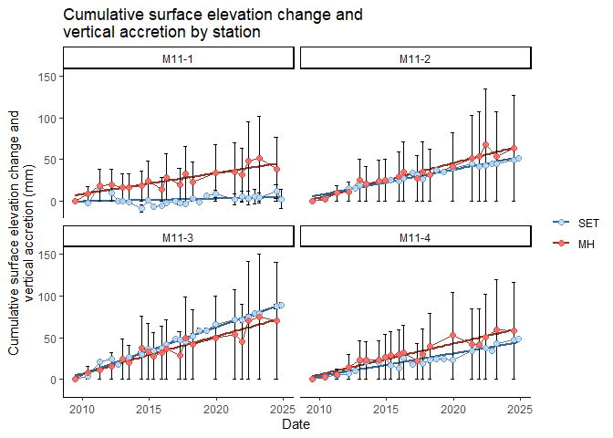

<!-- README.md is generated from README.Rmd. Please edit that file -->

# SETrNCBN

<!-- badges: start -->

[](https://github.com/laura-feher/NCBN_SETr/actions/workflows/R-CMD-check.yaml)
<!-- badges: end -->

The goal of SETrNCBN is to simplify the calculation of cumulative rates
of surface elevation change and vertical accretion from the National
Park Services’ Surface Elevation Table (SET) data.

This package is based on the [SETr](https://github.com/swmpkim/SETr)
package developed by Kim Cressman.

## Installation

You can install the development version from
[GitHub](https://github.com/) with:

``` r
# install.packages("devtools")
devtools::install_github("laura-feher/SETrNCBN")
```

## Load SET or MH data

Data can be pulled from the NPS I&M SET database using `load_set_data()`
for SET data or `load_mh_data()` for MH data. Use the network code
(`network_code`) or park code (`park_code`) arguments to filter the data
to a specific I&M network(s) or park(s) using the appropriate 4-letter
code.

``` r
library(SETrNCBN)
library(tidyverse)

set_df <- load_set_data(network_code = "NETN") %>%
    select(network_code, park_code, site_name, station_code, event_date_UTC, SET_direction, pin_position, pin_height_mm)

head(set_df)
#>   network_code park_code   site_name station_code event_date_UTC SET_direction
#> 1         NETN      ACAD Bass Harbor      BH1 old     2016-05-25             D
#> 2         NETN      ACAD Bass Harbor      BH1 old     2016-05-25             D
#> 3         NETN      ACAD Bass Harbor      BH1 old     2016-05-25             D
#> 4         NETN      ACAD Bass Harbor      BH1 old     2016-05-25             D
#> 5         NETN      ACAD Bass Harbor      BH1 old     2016-05-25             D
#> 6         NETN      ACAD Bass Harbor      BH1 old     2016-05-25             D
#>   pin_position pin_height_mm
#> 1            1           170
#> 2            2           172
#> 3            3           167
#> 4            4           160
#> 5            5           157
#> 6            6           155
```

You can also supply a list of multiple parks or networks:

``` r
set_df <- load_set_data(park = c("ASIS", "COLO")) %>%
    select(network_code, park_code, site_name, station_code, event_date_UTC, SET_direction, pin_position, pin_height_mm)

head(set_df)
#>   network_code park_code           site_name station_code event_date_UTC
#> 1         NCBN      ASIS Marsh 6 (Pine Tree)         M6-4     2016-03-28
#> 2         NCBN      ASIS Marsh 6 (Pine Tree)         M6-4     2016-03-28
#> 3         NCBN      ASIS Marsh 6 (Pine Tree)         M6-4     2016-03-28
#> 4         NCBN      ASIS Marsh 6 (Pine Tree)         M6-4     2015-04-23
#> 5         NCBN      ASIS Marsh 6 (Pine Tree)         M6-4     2015-04-23
#> 6         NCBN      ASIS Marsh 6 (Pine Tree)         M6-3     2016-03-28
#>   SET_direction pin_position pin_height_mm
#> 1             C            5           227
#> 2             D            8           228
#> 3             C            8           234
#> 4             C            5           225
#> 5             C            8           223
#> 6             B            5           200
```

Alternatively, if you have your data saved in a csv or xlsx file, you
can load it into R by supplying a file path. See
`? help(calc_change_cumu)` for required columns and data types if
supplying your own data.

``` r
set_df <- load_set_data(file_path = "./data/example_sets.csv")

head(set_df)
#> # A tibble: 6 × 11
#>   event_date_UTC network_code park_code site_name station_code SET_direction
#>   <date>         <chr>        <chr>     <chr>     <chr>        <chr>        
#> 1 2016-03-30     NCBN         ASIS      Marsh 11  M11-3        C            
#> 2 2014-12-01     NCBN         ASIS      Marsh 11  M11-3        A            
#> 3 2014-12-01     NCBN         ASIS      Marsh 11  M11-3        B            
#> 4 2014-12-01     NCBN         ASIS      Marsh 11  M11-3        B            
#> 5 2014-12-01     NCBN         ASIS      Marsh 11  M11-3        A            
#> 6 2014-12-01     NCBN         ASIS      Marsh 11  M11-3        A            
#> # ℹ 5 more variables: pin_position <dbl>, SET_offset_mm <dbl>,
#> #   pin_length_mm <dbl>, pin_height_mm <dbl>, set_type <chr>
```

## Calculate cumulative change

The function `calc_change_cumu()` can be used to calculate station- or
site-level cumulative surface elevation change from SET data or vertical
accretion from MH data. The resulting data frame has the mean station-
or site-level cumulative change for each sampling date.

``` r

# station-level rates of change
example_cumu_station <- calc_change_cumu(example_sets, level = "station")
head(example_cumu_station)
#> # A tibble: 6 × 9
#> # Groups:   network_code, park_code, site_name, station_code [1]
#>   network_code park_code site_name station_code event_date_UTC mean_cumu sd_cumu
#>   <chr>        <chr>     <chr>     <chr>        <date>             <dbl>   <dbl>
#> 1 NCBN         ASIS      Marsh 11  M11-1        2009-06-22          0       0   
#> 2 NCBN         ASIS      Marsh 11  M11-1        2010-06-08         -2.58    3.21
#> 3 NCBN         ASIS      Marsh 11  M11-1        2011-04-07         16.9     3.70
#> 4 NCBN         ASIS      Marsh 11  M11-1        2012-03-07          9.17    3.53
#> 5 NCBN         ASIS      Marsh 11  M11-1        2012-08-28         -0.75    2.11
#> 6 NCBN         ASIS      Marsh 11  M11-1        2012-12-18         -0.25    3.34
#> # ℹ 2 more variables: se_cumu <dbl>, data_type <chr>

# site-level rates of change
example_cumu_site <- calc_change_cumu(example_sets, level = "site")
head(example_cumu_site)
#> # A tibble: 6 × 8
#> # Groups:   network_code, park_code, site_name [1]
#>   network_code park_code site_name event_date_UTC mean_cumu sd_cumu se_cumu
#>   <chr>        <chr>     <chr>     <date>             <dbl>   <dbl>   <dbl>
#> 1 NCBN         ASIS      Marsh 11  2009-06-22          0       0       0   
#> 2 NCBN         ASIS      Marsh 11  2010-06-08          1.80    2.93    1.46
#> 3 NCBN         ASIS      Marsh 11  2011-04-07         12.9     7.36    3.68
#> 4 NCBN         ASIS      Marsh 11  2012-03-07         13.9     7.64    3.82
#> 5 NCBN         ASIS      Marsh 11  2012-08-28         10.4     8.15    4.08
#> 6 NCBN         ASIS      Marsh 11  2012-12-18         16.1    11.2     5.59
#> # ℹ 1 more variable: data_type <chr>
```

## Plotting cumulative change

The function `plot_cumu()` can be used to plot station- or site-level
cumulative surface elevation change from SET data or vertical accretion
from MH data. You can also plot SET data and MH data on the same plot by
supplying data frames to both the `SET_data` and `MH_data` arguments.

``` r
plot_cumu(SET_data = example_sets, level = "station")
```


``` r
plot_cumu(MH_data = example_mh, level = "station")
```


``` r
library(ggh4x)

# Plot SET and MH data for each station together on a single plot:
plot_cumu(SET_data = example_sets, MH_data = example_mh, columns = 2)
```


## Calculate linear rates of change

The function `calc_linear_rates()` can be used to calculate simple
linear rates of change at the station-or site-level in mm/yr.

``` r
station_rates <- calc_linear_rates(example_sets, level = "station")

station_rates %>%
    dplyr::ungroup() %>%
    dplyr::select(park_code, site_name, station_code, rate, rate_se, rate_level)
#> # A tibble: 4 × 6
#>   park_code site_name station_code  rate rate_se rate_level
#>   <chr>     <chr>     <chr>        <dbl>   <dbl> <chr>     
#> 1 ASIS      Marsh 11  M11-1        0.328   0.258 station   
#> 2 ASIS      Marsh 11  M11-2        3.04    0.124 station   
#> 3 ASIS      Marsh 11  M11-3        5.59    0.138 station   
#> 4 ASIS      Marsh 11  M11-4        2.72    0.226 station

site_rates <- calc_linear_rates(example_sets, level = "site")

site_rates %>%
    dplyr::ungroup() %>%
    dplyr::select(park_code, site_name, rate, rate_se, rate_level)
#> # A tibble: 1 × 5
#>   park_code site_name  rate rate_se rate_level
#>   <chr>     <chr>     <dbl>   <dbl> <chr>     
#> 1 ASIS      Marsh 11   2.92   0.111 site
```

## Visually compare rates of change

The function `plot_rate_comps()` can be used to create ‘tie fighter’
plots that are helpful for visually comparing rates of surface elevation
change or vertical accretion between stations or sites:

``` r
plot_rate_comps(example_sets, level = "station")
```


Alternatively, if you’ve already calculated rates of change and want to
plot those, you can use the ‘rates’ argument to supply a data frame of
rates that has columns for station IDs, station-level rates, and station
rate std errors with one row per station:

``` r
example_rates <- data.frame(
    "station_code" = c("station_1", "station_2", "station_3"),
    "rate" = c(3.2, 4.0, 5.4),
    "rate_se" = c(1, 0.5, 0.25)) %>%
    mutate(network_code = "NCBN",
           park_code = "ABCD",
           site_name = "Site A") %>%
    group_by(network_code, park_code, site_name, station_code) %>%
    select(network_code, park_code, site_name, station_code, rate, rate_se)

plot_rate_comps(rates = example_rates, level = "station")
```



## Get park-specific SLR data & rates

The function `get_sea_level_data()` can be used to get rates of
sea-level rise from the NOAA tide gauge that is closest to a specific
park. The function returns a list with 2 data frames: ‘slr_data’ is the
relative sea-level data downloaded from the NOAA tides and currents
website; ‘slr_rate’ provides the calculated rate of sea-level rise,
standard error of the SLR rate, lower confidence interval, upper,
minimum year of data used for calculating SLR, and maximum year of data
used for calculating SLR. You can access each data frame in the list
using `$` or `[]` notation.

``` r
ASIS_sea_level <- get_sea_level_data("ASIS")

head(ASIS_sea_level$slr_data)
#>   Year Month Linear_Trend High_Conf. Low_Conf.       date   min_date         yr
#> 1 1975     6       -0.086     -0.064    -0.109 1975-06-01 1975-06-01 0.00000000
#> 2 1975     7       -0.086     -0.064    -0.108 1975-07-01 1975-06-01 0.08213552
#> 3 1975     8       -0.086     -0.064    -0.108 1975-08-01 1975-06-01 0.16700890
#> 4 1975     9       -0.085     -0.063    -0.107 1975-09-01 1975-06-01 0.25188227
#> 5 1975    10       -0.085     -0.063    -0.107 1975-10-01 1975-06-01 0.33401780
#> 6 1975    11       -0.084     -0.062    -0.106 1975-11-01 1975-06-01 0.41889117
#>   Monthly_MSL_m Monthly_MSL_mm
#> 1        -0.006             -6
#> 2         0.017             17
#> 3         0.019             19
#> 4         0.003              3
#> 5         0.009              9
#> 6         0.045             45

head(ASIS_sea_level$slr_rate)
#> # A tibble: 1 × 9
#>   model model_summary slr_rate slr_intc slr_rate_se lower_ci upper_ci min_year  
#>   <lis> <list>           <dbl>    <dbl>       <dbl>    <dbl>    <dbl> <date>    
#> 1 <lm>  <smmry.lm>        5.29    -87.9       0.220     4.86     5.73 1975-06-01
#> # ℹ 1 more variable: max_year <date>
```

You can also supply a start year and/or end year if you want to limit
the calculation of SLR to a specific time frame. This could be useful
for calculating a SLR rate from the most recent tidal datum:

``` r
ASIS_sea_level_2001_2019 <- get_sea_level_data("ASIS", trend_start_year = 2001, trend_end_year = 2019)

head(ASIS_sea_level_2001_2019$slr_data)
#>   Year Month Linear_Trend High_Conf. Low_Conf.       date   min_date         yr
#> 1 2002     8        0.057      0.068     0.046 2002-08-01 2002-08-01 0.00000000
#> 2 2002     9        0.057      0.068     0.047 2002-09-01 2002-08-01 0.08487337
#> 3 2002    10        0.058      0.068     0.047 2002-10-01 2002-08-01 0.16700890
#> 4 2002    11        0.058      0.069     0.048 2002-11-01 2002-08-01 0.25188227
#> 5 2002    12        0.059      0.069     0.048 2002-12-01 2002-08-01 0.33401780
#> 6 2003     1        0.059      0.070     0.049 2003-01-01 2002-08-01 0.41889117
#>   Monthly_MSL_m Monthly_MSL_mm
#> 1         0.052             52
#> 2         0.053             53
#> 3         0.089             89
#> 4        -0.023            -23
#> 5         0.022             22
#> 6         0.015             15

head(ASIS_sea_level_2001_2019$slr_rate)
#> # A tibble: 1 × 9
#>   model model_summary slr_rate slr_intc slr_rate_se lower_ci upper_ci min_year  
#>   <lis> <list>           <dbl>    <dbl>       <dbl>    <dbl>    <dbl> <date>    
#> 1 <lm>  <smmry.lm>        7.26     27.8       0.803     5.68     8.85 2002-08-01
#> # ℹ 1 more variable: max_year <date>
```
